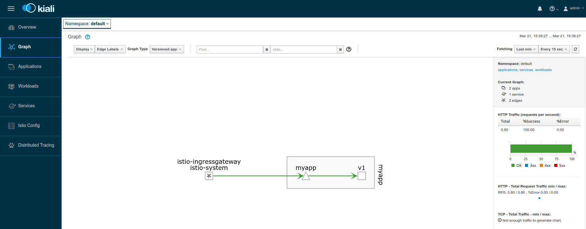
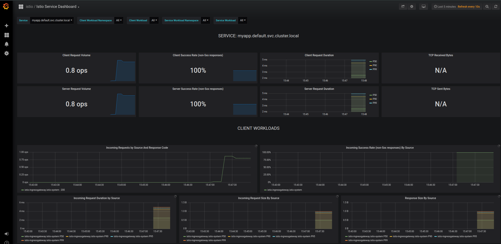
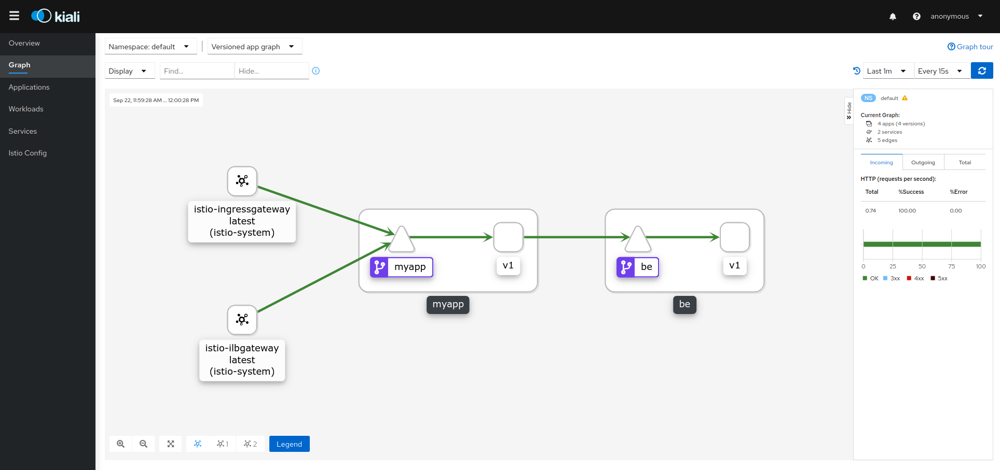
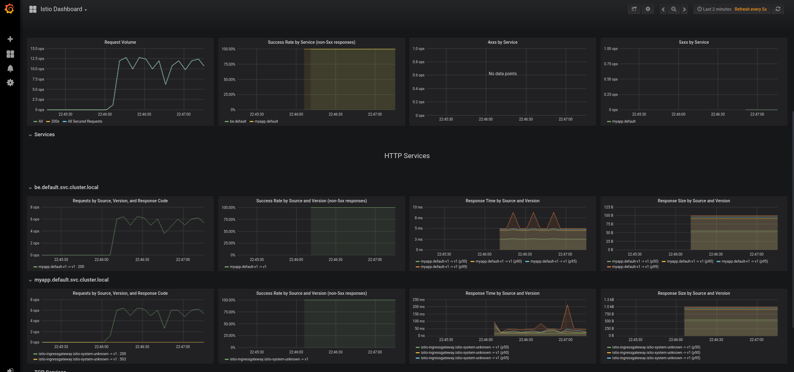
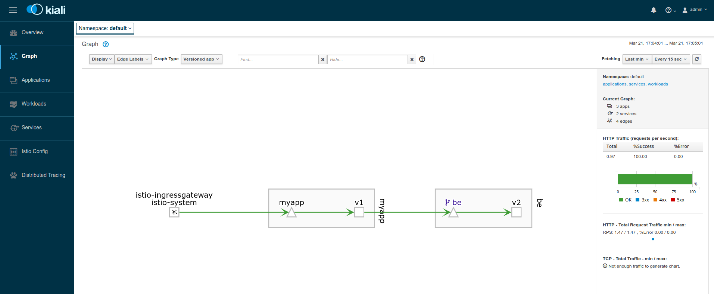
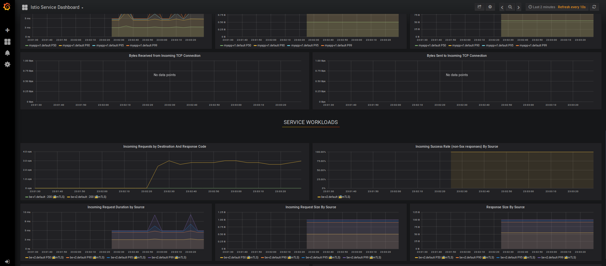
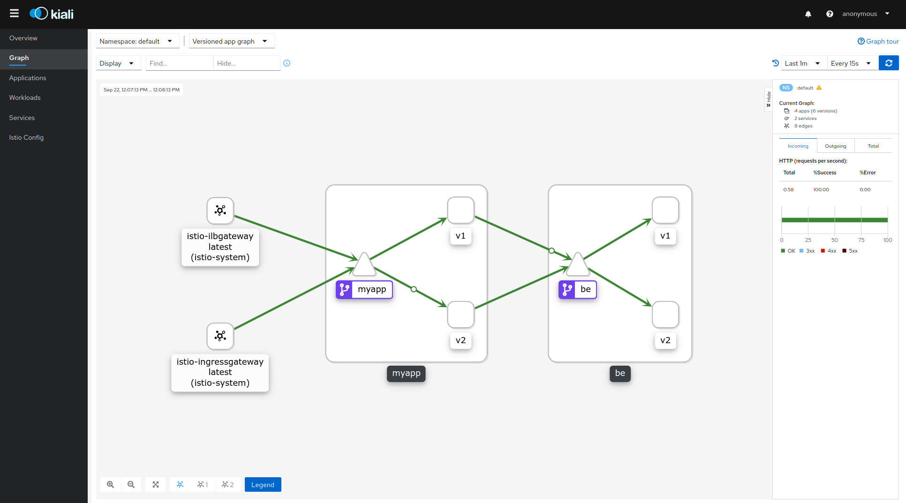
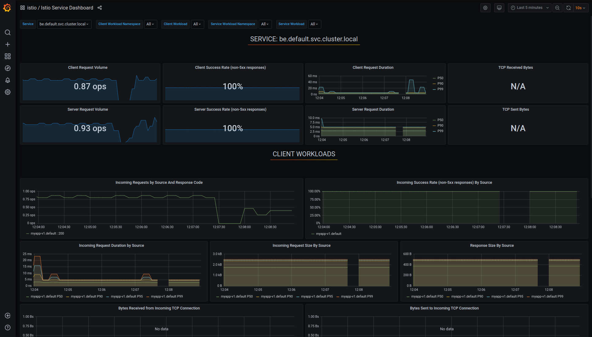
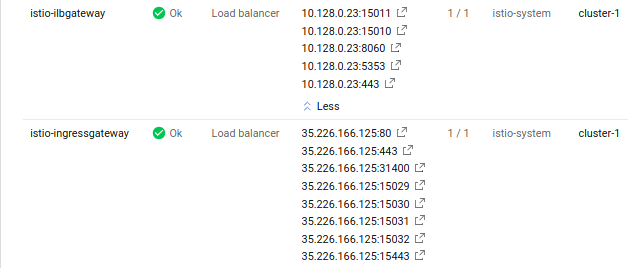
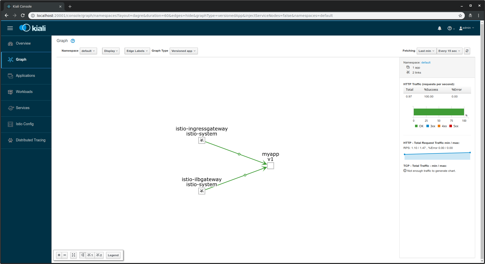

# Istio "Hello World" my way

## What is this repo?

This is a really simple application I wrote over holidays a year ago (12/17) that details my experiences and
feedback with istio.  To be clear, its a really basic NodeJS application that i used here but more importantly, it covers
the main sections of [Istio](https://istio.io/) that i was seeking to understand better (if even just as a helloworld).  

I do know isito has the "[bookinfo](https://github.com/istio/istio/tree/master/samples/bookinfo)" application but the best way
i understand something is to rewrite sections and only those sections from the ground up.

## Istio version used

* 04/03/24: Istio 1.21.0
* 09/05/22: Istio 1.15.0
* 03/19/21: Istio 1.9.1
* 12/21/20: Istio 1.8.0
* 09/22/20: Istio 1.7.2
* 04/28/20: Istio 1.5.2
* 10/12/19: Istio 1.3.2
* 03/10/19:  Istio 1.1.0
* 01/09/19:  Istio 1.0.5
* [Prior Istio Versions](https://github.com/salrashid123/istio_helloworld/tags)


## What i tested

- [Basic istio Installation on Google Kubernetes Engine](#lets-get-started)
- [Grafana, Prometheus, Kiali, Jaeger](#setup-some-tunnels-to-each-of-the-services)
- [Route Control](#route-control)
- [Canary Deployments with VirtualService](#canary-deployments-with-virtualservice)
- [Destination Rules](#destination-rules)
- [Egress Rules](#egress-rules)
- [Egress Gateway](#egress-gateway)
- [WebAssembly](#webassembly)
- [LUA HttpFilter](#lua-httpfilter)
- [Authorization](#autorization)
- [JWT Authentication an Authorization](#jwt-auth-autorization)
- [Service to Service Authentication Policy](service-to-service-rbac-and-authentication-policy)
- [Internal LoadBalancer (GCP)](#internal-loadbalancer)
- [Mixer Out of Process Authorization Adapter](https://github.com/salrashid123/istio_custom_auth_adapter)
- [Access GCE MetadataServer](#access-GCE-metadataServer)

You can also find info about istio+external authorization server here:

- [Istio External Authorization Server](https://github.com/salrashid123/istio_external_authorization_server)


## What is the app you used?

NodeJS in a Dockerfile...something really minimal.  You can find the entire source under the 'nodeapp' folder in this repo.

The endpoints on this app are as such:

- ```/```:  Does nothing;  ([source](https://github.com/salrashid123/istio_helloworld/blob/master/nodeapp/app.js#L24))
- ```/varz```:  Returns all the environment variables on the current Pod ([source](https://github.com/salrashid123/istio_helloworld/blob/master/nodeapp/app.js#L33))
- ```/version```: Returns just the "process.env.VER" variable that was set on the Deployment ([source](https://github.com/salrashid123/istio_helloworld/blob/master/nodeapp/app.js#L37))
- ```/backend```: Return the nodename, pod name.  Designed to only get called as if the applciation running is a `backend` ([source](https://github.com/salrashid123/istio_helloworld/blob/master/nodeapp/app.js#L41))
- ```/hostz```:  Does a DNS SRV lookup for the `backend` and makes an http call to its `/backend`, endpoint ([source](https://github.com/salrashid123/istio_helloworld/blob/master/nodeapp/app.js#L45))
- ```/requestz```:  Makes an HTTP fetch for several external URLs (used to show egress rules) ([source](https://github.com/salrashid123/istio_helloworld/blob/master/nodeapp/app.js#L120))
- ```/headerz```:  Displays inbound headers
 ([source](https://github.com/salrashid123/istio_helloworld/blob/master/nodeapp/app.js#L115))
- ```/metadata```: Access the GCP MetadataServer using hostname and link-local IP address ([source](https://github.com/salrashid123/istio_helloworld/blob/master/nodeapp/app.js#L125))
- ```/remote```: Access `/backend` while deployed in a remote istio cluster  ([source](https://github.com/salrashid123/istio_helloworld/blob/master/nodeapp/app.js#L145))

I build and uploaded this app to dockerhub at

```
docker.io/salrashid123/istioinit:1
docker.io/salrashid123/istioinit:2
```

(basically, they're both the same application but each has an environment variable that signifies which 'verison; they represent.  The version information for each image is returned by the `/version` endpoint)

You're also free to build and push these images directly:

```bash
docker build  --build-arg VER=1 -t your_dockerhub_id/istioinit:1 .
docker build  --build-arg VER=2 -t your_dockerhub_id/istioinit:2 .

docker push your_dockerhub_id/istioinit:1
docker push your_dockerhub_id/istioinit:2
```

To give you a sense of the differences between a regular GKE specification yaml vs. one modified for istio, you can compare:
- [all-istio.yaml](all-istio.yaml)  vs [all-gke.yaml](all-gke.yaml)
(review Ingress config, etc)

## Lets get started

### Create GKE Cluster and Bootstrap Istio

Note, the following cluster is setup with a  [aliasIPs](https://cloud.google.com/kubernetes-engine/docs/how-to/alias-ips) (`--enable-ip-alias` )

We will be installing istio with [istioctl](https://istio.io/docs/setup/install/istioctl/)

```bash
gcloud container  clusters create cluster-1 --machine-type "n1-standard-2" --zone us-central1-a  --num-nodes 3 --enable-ip-alias -q

gcloud container clusters get-credentials cluster-1 --zone us-central1-a

kubectl create clusterrolebinding cluster-admin-binding --clusterrole=cluster-admin --user=$(gcloud config get-value core/account)

kubectl create ns istio-system

export ISTIO_VERSION=1.21.0
export ISTIO_VERSION_MINOR=1.21

wget -P /tmp/ https://github.com/istio/istio/releases/download/$ISTIO_VERSION/istio-$ISTIO_VERSION-linux-amd64.tar.gz
tar xvf /tmp/istio-$ISTIO_VERSION-linux-amd64.tar.gz -C /tmp/
rm /tmp/istio-$ISTIO_VERSION-linux-amd64.tar.gz

export PATH=/tmp/istio-$ISTIO_VERSION/bin:$PATH

istioctl install --set profile=demo \
 --set meshConfig.enableAutoMtls=true  \
 --set values.gateways.istio-ingressgateway.runAsRoot=true \
 --set meshConfig.outboundTrafficPolicy.mode=REGISTRY_ONLY  \
 -f overlay-istio-gateway.yaml

$ istioctl profile dump --config-path components.ingressGateways demo
$ istioctl profile dump --config-path values.gateways.istio-ingressgateway demo

kubectl apply -f https://raw.githubusercontent.com/istio/istio/release-$ISTIO_VERSION_MINOR/samples/addons/prometheus.yaml
sleep 20
kubectl apply -f https://raw.githubusercontent.com/istio/istio/release-$ISTIO_VERSION_MINOR/samples/addons/kiali.yaml
kubectl apply -f https://raw.githubusercontent.com/istio/istio/release-$ISTIO_VERSION_MINOR/samples/addons/grafana.yaml
kubectl apply -f https://raw.githubusercontent.com/istio/istio/release-$ISTIO_VERSION_MINOR/samples/addons/jaeger.yaml

kubectl label namespace default istio-injection=enabled
```

Wait maybe 2 to 3 minutes and make sure all the Deployments are live:

- For reference, here are the Istio [operator installation options](https://istio.io/docs/reference/config/istio.operator.v1alpha1/)

### Make sure the Istio installation is ready

Verify this step by making sure all the ```Deployments``` are Available.

```bash
$ kubectl get no,po,rc,svc,ing,deployment -n istio-system 
NAME                                            STATUS   ROLES    AGE   VERSION
node/gke-cluster-1-default-pool-444c6b8c-0gx4   Ready    <none>   12m   v1.27.8-gke.1067004
node/gke-cluster-1-default-pool-444c6b8c-p46d   Ready    <none>   12m   v1.27.8-gke.1067004
node/gke-cluster-1-default-pool-444c6b8c-s5sk   Ready    <none>   12m   v1.27.8-gke.1067004

NAME                                       READY   STATUS    RESTARTS   AGE
pod/grafana-74b5fcd7b4-d8nbb               1/1     Running   0          32s
pod/istio-egressgateway-5cdbc95b55-kz74s   1/1     Running   0          2m30s
pod/istio-ilbgateway-5d6dd5449b-swz9q      1/1     Running   0          2m30s
pod/istio-ingressgateway-fb484f94-f7hs6    1/1     Running   0          2m30s
pod/istiod-b4f5579b4-jh7rs                 1/1     Running   0          2m37s
pod/jaeger-db6bdfcb4-w8f2v                 1/1     Running   0          30s
pod/kiali-58cf9b49d8-tbl2z                 1/1     Running   0          39s
pod/prometheus-6775dd4ddb-qtfkb            2/2     Running   0          98s

NAME                           TYPE           CLUSTER-IP      EXTERNAL-IP     PORT(S)                                          AGE
service/grafana                ClusterIP      10.68.122.55    <none>          3000/TCP                                         32s
service/istio-egressgateway    ClusterIP      10.68.124.26    <none>          80/TCP,443/TCP                                   2m30s
service/istio-ilbgateway       LoadBalancer   10.68.126.221   10.128.15.211   443:31368/TCP                                    2m29s
service/istio-ingressgateway   LoadBalancer   10.68.119.16    34.30.141.132   443:32556/TCP                                    2m29s
service/istiod                 ClusterIP      10.68.118.70    <none>          15010/TCP,15012/TCP,443/TCP,15014/TCP            2m37s
service/jaeger-collector       ClusterIP      10.68.118.32    <none>          14268/TCP,14250/TCP,9411/TCP,4317/TCP,4318/TCP   30s
service/kiali                  ClusterIP      10.68.114.32    <none>          20001/TCP                                        39s
service/prometheus             ClusterIP      10.68.123.245   <none>          9090/TCP                                         98s
service/tracing                ClusterIP      10.68.121.223   <none>          80/TCP,16685/TCP                                 30s
service/zipkin                 ClusterIP      10.68.116.193   <none>          9411/TCP                                         30s

NAME                                   READY   UP-TO-DATE   AVAILABLE   AGE
deployment.apps/grafana                1/1     1            1           32s
deployment.apps/istio-egressgateway    1/1     1            1           2m31s
deployment.apps/istio-ilbgateway       1/1     1            1           2m30s
deployment.apps/istio-ingressgateway   1/1     1            1           2m30s
deployment.apps/istiod                 1/1     1            1           2m37s
deployment.apps/jaeger                 1/1     1            1           30s
deployment.apps/kiali                  1/1     1            1           39s
deployment.apps/prometheus             1/1     1            1           98s
```


### Make sure the Istio an IP for the ```LoadBalancer``` is assigned:

Run

```bash
$ kubectl get svc istio-ingressgateway -n istio-system

export GATEWAY_IP=$(kubectl -n istio-system get service istio-ingressgateway -o jsonpath='{.status.loadBalancer.ingress[0].ip}')
echo $GATEWAY_IP
```


### Setup some tunnels to each of the services

Open up several new shell windows and type in one line into each:

```bash
kubectl -n istio-system port-forward $(kubectl -n istio-system get pod -l app.kubernetes.io/name=grafana -o jsonpath='{.items[0].metadata.name}') 3000:3000

kubectl port-forward -n istio-system $(kubectl get pod -n istio-system -l app=jaeger -o jsonpath='{.items[0].metadata.name}') 16686:16686

kubectl -n istio-system port-forward $(kubectl -n istio-system get pod -l app.kubernetes.io/name=kiali -o jsonpath='{.items[0].metadata.name}') 20001:20001
```

Open up a browser (4 tabs) and go to:
- Kiali http://localhost:20001/kiali (username: admin, password: admin)
- Grafana http://localhost:3000/dashboards
- Jaeger http://localhost:16686


### Deploy the sample application

The default ```all-istio.yaml``` runs:

- Ingress with SSL
- Deployments:
- - myapp-v1:  1 replica
- - myapp-v2:  1 replica
- - be-v1:  1 replicas
- - be-v2:  1 replicas

basically, a default frontend-backend scheme with one replicas for each `v1` and `v2` versions.

> Note: the default yaml pulls and run my dockerhub image- feel free to change this if you want.


```bash
kubectl apply -f all-istio.yaml
kubectl apply -f istio-lb-certs.yaml
```

Now enable the ingress gateway for both external and internal loadbalancer traffic on _only_ port `:443`:

```bash
kubectl apply -f istio-ingress-gateway.yaml -f istio-ingress-ilbgateway.yaml 

kubectl apply -f istio-fev1-bev1.yaml
```

Wait until the deployments complete:

```bash

$ kubectl get po,deployments,svc,ing

NAME                            READY   STATUS    RESTARTS   AGE
pod/be-v1-5cc646694b-l7qsz      2/2     Running   0          37s
pod/be-v2-d5988c4cd-2xwpx       2/2     Running   0          37s
pod/myapp-v1-5d56985f68-4678g   2/2     Running   0          37s
pod/myapp-v2-56c8b9b9c8-h6d2c   2/2     Running   0          37s

NAME                       READY   UP-TO-DATE   AVAILABLE   AGE
deployment.apps/be-v1      1/1     1            1           37s
deployment.apps/be-v2      1/1     1            1           37s
deployment.apps/myapp-v1   1/1     1            1           38s
deployment.apps/myapp-v2   1/1     1            1           37s

NAME                 TYPE        CLUSTER-IP      EXTERNAL-IP   PORT(S)    AGE
service/be           ClusterIP   10.68.113.54    <none>        8080/TCP   37s
service/kubernetes   ClusterIP   10.68.112.1     <none>        443/TCP    21m
service/myapp        ClusterIP   10.68.118.161   <none>        8080/TCP   38s
```

Notice that each pod has two containers:  one is from isto, the other is the applicaiton itself (this is because we have automatic sidecar injection enabled on the `default` namespace).

Also note that in ```all-istio.yaml``` we did not define an ```Ingress``` object though we've defined a TLS secret with a very specific metadata name: ```istio-ingressgateway-certs```.  That is a special name for a secret that is used by Istio to setup its own ingress gateway:


#### Ingress Gateway Secret in 1.0.0+

Note the ```istio-ingress-gateway``` secret specifies the Ingress cert to use (the specific metadata name is special and is **required**)

```yaml
apiVersion: v1
data:
  tls.crt: _redacted_
  tls.key: _redacted_
kind: Secret
metadata:
  name: istio-ingressgateway-certs
  namespace: istio-system
type: kubernetes.io/tls
```

Remember we've acquired the ```$GATEWAY_IP``` earlier:

```bash
export GATEWAY_IP=$(kubectl -n istio-system get service istio-ingressgateway -o jsonpath='{.status.loadBalancer.ingress[0].ip}')
echo $GATEWAY_IP
```

### Send Traffic

This section shows basic user->frontend traffic and see the topology and telemetry in the Kiali and Grafana consoles:

#### Frontend only

So...lets send traffic with the ip to the ```/versions```  on the frontend

```bash
for i in {1..1000}; do curl  --cacert certs/root-ca.crt  --resolve istio.domain.com:443:$GATEWAY_IP  https://istio.domain.com/version; sleep 1; done
```

you may need to restart the ingress pod if the certs they used didn't pickup
```bash
INGRESS_POD_NAME=$(kubectl get po -n istio-system | grep ingressgateway\- | awk '{print$1}'); echo ${INGRESS_POD_NAME};
kubectl delete po/$INGRESS_POD_NAME -n istio-system
```

You should see a sequence of 1's indicating the version of the frontend you just hit

```
111111111111111111111111111111111
```

(source: [/version](https://github.com/salrashid123/istio_helloworld/blob/master/nodeapp/app.js#L37) endpoint)

You should also see on kiali just traffic from ingress -> `fe:v1`



and in grafana:




#### Frontend and Backend

Now the next step in th exercise:

to send requests to ```user-->frontend--> backend```;  we'll use the  ```/hostz``` endpoint to do that.  Remember, the `/hostz` endpoint takes a frontend request, sends it to the backend which inturn echos back the podName the backend runs as.  The entire response is then returned to the user.  This is just a way to show the which backend host processed the requests.

(note i'm using  [jq](https://stedolan.github.io/jq/) utility to parse JSON)

```bash
for i in {1..1000}; do --cacert certs/root-ca.crt  --resolve istio.domain.com:443:$GATEWAY_IP  https://istio.domain.com/hostz | jq '.[0].body'; sleep 1; done
```

you should see output indicating traffic from the v1 backend verison: ```be-v1-*```.  Thats what we expect since our original rule sets defines only `fe:v1` and `be:v1` as valid targets.

```bash
$ for i in {1..1000}; do curl -s --cacert certs/root-ca.crt  --resolve istio.domain.com:443:$GATEWAY_IP  https://istio.domain.com/hostz | jq '.[0].body'; sleep 1; done

"pod: [be-v1-5cc646694b-l7qsz]    node: [gke-cluster-1-default-pool-444c6b8c-0gx4]"
"pod: [be-v1-5cc646694b-l7qsz]    node: [gke-cluster-1-default-pool-444c6b8c-0gx4]"
"pod: [be-v1-5cc646694b-l7qsz]    node: [gke-cluster-1-default-pool-444c6b8c-0gx4]"
"pod: [be-v1-5cc646694b-l7qsz]    node: [gke-cluster-1-default-pool-444c6b8c-0gx4]"
"pod: [be-v1-5cc646694b-l7qsz]    node: [gke-cluster-1-default-pool-444c6b8c-0gx4]"
```

Note both Kiali and Grafana shows both frontend and backend service telemetry and traffic to ```be:v1```






## Route Control

This section details how to selectively send traffic to specific service versions and control traffic routing.

### Selective Traffic

In this sequence,  we will setup a routecontrol to:

1. Send all traffic to ```myapp:v1```.  
2. traffic from ```myapp:v1``` can only go to ```be:v2```

Basically, this is a convoluted way to send traffic from `fe:v1`-> `be:v2` even if all services and versions are running.

The yaml on ```istio-fev1-bev2.yaml``` would direct inbound traffic for ```myapp:v1``` to go to ```be:v2``` based on the ```sourceLabels:```.  The snippet for this config is:

```yaml
apiVersion: networking.istio.io/v1beta1
kind: VirtualService
metadata:
  name: be-virtualservice
spec:
  gateways:
  - mesh
  hosts:
  - be
  http:
  - match:
    - sourceLabels:
        app: myapp
        version: v1
    route:
    - destination:
        host: be
        subset: v2
      weight: 100
---
apiVersion: networking.istio.io/v1beta1
kind: DestinationRule
metadata:
  name: be-destination
spec:
  host: be
  trafficPolicy:
    tls:
      mode: ISTIO_MUTUAL
    loadBalancer:
      simple: ROUND_ROBIN
  subsets:
  - name: v1
    labels:
      version: v1
  - name: v2
    labels:
      version: v2
```

So lets apply the config with kubectl:

```bash
kubectl replace -f istio-fev1-bev2.yaml
```

After sending traffic,  check which backend system was called by invoking ```/hostz``` endpoint on the frontend.

What the ```/hostz``` endpoint does is takes a users request to ```fe-*``` and targets any ```be-*``` that is valid.  Since we only have ```fe-v1``` instances running and the fact we setup a rule such that only traffic from `fe:v1` can go to `be:v2`, all the traffic outbound for ```be-*``` must terminate at a ```be-v2```:

```bash
$ for i in {1..1000}; do curl -s --cacert certs/root-ca.crt  --resolve istio.domain.com:443:$GATEWAY_IP  https://istio.domain.com/hostz | jq '.[0].body'; sleep 1; done

"pod: [be-v2-d5988c4cd-2xwpx]    node: [gke-cluster-1-default-pool-444c6b8c-p46d]"
"pod: [be-v2-d5988c4cd-2xwpx]    node: [gke-cluster-1-default-pool-444c6b8c-p46d]"
"pod: [be-v2-d5988c4cd-2xwpx]    node: [gke-cluster-1-default-pool-444c6b8c-p46d]"
"pod: [be-v2-d5988c4cd-2xwpx]    node: [gke-cluster-1-default-pool-444c6b8c-p46d]"
"pod: [be-v2-d5988c4cd-2xwpx]    node: [gke-cluster-1-default-pool-444c6b8c-p46d]"
```

and on the frontend version is always one.
```bash
for i in {1..100}; do curl--cacert certs/root-ca.crt  --resolve istio.domain.com:443:$GATEWAY_IP  https://istio.domain.com/version; sleep 1; done
11111111111111111111111111111
```

Note the traffic to ```be-v1``` is 0 while there is a non-zero traffic to ```be-v2``` from ```fe-v1```:



Look at the incoming requests by source graph:




If we now overlay rules that direct traffic allow interleaved  ```fe(v1|v2) -> be(v1|v2)``` we expect to see requests to both frontend v1 and backend

```bash
kubectl replace -f istio-fev1v2-bev1v2.yaml
```

then frontend is both v1 and v2:
```bash
for i in {1..1000}; do curl --cacert certs/root-ca.crt  --resolve istio.domain.com:443:$GATEWAY_IP  https://istio.domain.com/version;  sleep 1; done
111211112122211121212211122211
```

and backend is responses comes from both be-v1 and be-v2

```bash
$ for i in {1..1000}; do curl -s --cacert certs/root-ca.crt  --resolve istio.domain.com:443:$GATEWAY_IP  https://istio.domain.com/hostz | jq '.[0].body'; sleep 1; done

"pod: [be-v1-5cc646694b-l7qsz]    node: [gke-cluster-1-default-pool-444c6b8c-0gx4]"
"pod: [be-v1-5cc646694b-l7qsz]    node: [gke-cluster-1-default-pool-444c6b8c-0gx4]"
"pod: [be-v1-5cc646694b-l7qsz]    node: [gke-cluster-1-default-pool-444c6b8c-0gx4]"
"pod: [be-v2-d5988c4cd-2xwpx]    node: [gke-cluster-1-default-pool-444c6b8c-p46d]"
"pod: [be-v2-d5988c4cd-2xwpx]    node: [gke-cluster-1-default-pool-444c6b8c-p46d]"
"pod: [be-v2-d5988c4cd-2xwpx]    node: [gke-cluster-1-default-pool-444c6b8c-p46d]"
"pod: [be-v1-5cc646694b-l7qsz]    node: [gke-cluster-1-default-pool-444c6b8c-0gx4]"
"pod: [be-v2-d5988c4cd-2xwpx]    node: [gke-cluster-1-default-pool-444c6b8c-p46d]"
```






### Route Path

Now lets setup a more selective route based on a specific path in the URI:

- The rule we're defining is: "_First_ route requests to myapp where `path=/version` to only go to the ```v1``` set"...if there is no match, fall back to the default routes where you send `20%` traffic to `v1` and `80%` traffic to `v2`


```yaml
---
apiVersion: networking.istio.io/v1beta1
kind: VirtualService
metadata:
  name: myapp-virtualservice
spec:
  hosts:
  - "*"
  gateways:
  - my-gateway
  http:
  - match:
    - uri:
        exact: /version
    route:
    - destination:
        host: myapp
        subset: v1
  - route:
    - destination:
        host: myapp
        subset: v1
      weight: 20
    - destination:
        host: myapp
        subset: v2
      weight: 80
```


```bash
kubectl replace -f istio-route-version-fev1-bev1v2.yaml
```

So check all requests to `/version` are `fe:v1`

```bash
for i in {1..1000}; do curl --cacert certs/root-ca.crt  --resolve istio.domain.com:443:$GATEWAY_IP  https://istio.domain.com/version; sleep 1; done
1111111111111111111
```

You may have noted how the route to any other endpoint other than `/version` destination is weighted split and not delcared round robin (eg:)
```yaml
  - route:
    - destination:
        host: myapp
        subset: v1
      weight: 20
    - destination:
        host: myapp
        subset: v2
      weight: 80
```

Anyway, now lets edit rule to  and change the prefix match to ```/xversion``` so the match *doesn't apply*.   What we expect is a request to http://gateway_ip/version will go to v1 and v2 (since the path rule did not match and the split is the fallback rule.

```bash
kubectl replace -f istio-route-version-fev1-bev1v2.yaml

```
Observe the version of the frontend you're hitting:

```bash
for i in {1..1000}; do curl --cacert certs/root-ca.crt  --resolve istio.domain.com:443:$GATEWAY_IP  https://istio.domain.com/version; sleep 1; done
2121212222222222222221122212211222222222222222
```

What you're seeing is ```myapp-v1``` now getting about `20%` of the traffic while ```myapp-v2``` gets `80%` because the previous rule doens't match.

Undo that change `/xversion` --> `/version` and reapply to baseline:

```bash
kubectl replace -f istio-route-version-fev1-bev1v2.yaml
```

#### Canary Deployments with VirtualService

You can use this traffic distribuion mechanism to run canary deployments between released versions.  For example, a rule like the following will split the traffic between `v1|v2` at `80/20` which you can use to gradually roll traffic over to `v2` by applying new percentage weights.


```yaml
apiVersion: networking.istio.io/v1beta1
kind: VirtualService
metadata:
  name: myapp-virtualservice
spec:
  hosts:
  - "*"
  gateways:
  - my-gateway
  - my-gateway-ilb
  http:
  - route:
    - destination:
        host: myapp
        subset: v1
      weight: 80
    - destination:
        host: myapp
        subset: v2
      weight: 20
```
### Destination Rules

Lets configure Destination rules such that all traffic from ```myapp-v1``` round-robins to both version of the backend.

First lets  force all gateway requests to go to ```v1``` only:

on ```istio-fev1-bev1v2.yaml```:


```yaml
apiVersion: networking.istio.io/v1beta1
kind: VirtualService
metadata:
  name: myapp-virtualservice
spec:
  hosts:
  - "*"
  gateways:
  - my-gateway
  - my-gateway-ilb
  http:
  - route:
    - destination:
        host: myapp
        subset: v1
```


And where the backend trffic is split between ```be-v1``` and ```be-v2``` with a ```ROUND_ROBIN```

```yaml
apiVersion: networking.istio.io/v1beta1
kind: DestinationRule
metadata:
  name: be-destination
spec:
  host: be
  trafficPolicy:
    tls:
      mode: ISTIO_MUTUAL
    loadBalancer:
      simple: ROUND_ROBIN
  subsets:
  - name: v1
    labels:
      version: v1
  - name: v2
    labels:
      version: v2
```

After you apply the rule,

```
kubectl replace -f istio-fev1-bev1v2.yaml
```

you'll see frontend request all going to ```fe-v1```

```bash
for i in {1..1000}; do curl --cacert certs/root-ca.crt  --resolve istio.domain.com:443:$GATEWAY_IP  https://istio.domain.com/version; sleep 1; done
11111111111111
```

with backend requests coming from _pretty much_ round robin

```bash
$ for i in {1..1000}; do curl --cacert certs/root-ca.crt  --resolve istio.domain.com:443:$GATEWAY_IP  https://istio.domain.com/hostz | jq '.[0].body'; sleep 1; done

"pod: [be-v1-58855cf854-t6rz9]    node: [gke-cluster-1-default-pool-7907ec5d-jrwq]"
"pod: [be-v2-8475cfb896-wxt4z]    node: [gke-cluster-1-default-pool-7907ec5d-nxvx]"
"pod: [be-v1-58855cf854-t6rz9]    node: [gke-cluster-1-default-pool-7907ec5d-jrwq]"
"pod: [be-v2-8475cfb896-wxt4z]    node: [gke-cluster-1-default-pool-7907ec5d-nxvx]"
"pod: [be-v1-58855cf854-t6rz9]    node: [gke-cluster-1-default-pool-7907ec5d-jrwq]"
"pod: [be-v2-8475cfb896-wxt4z]    node: [gke-cluster-1-default-pool-7907ec5d-nxvx]"
"pod: [be-v1-58855cf854-t6rz9]    node: [gke-cluster-1-default-pool-7907ec5d-jrwq]"
"pod: [be-v2-8475cfb896-wxt4z]    node: [gke-cluster-1-default-pool-7907ec5d-nxvx]"
"pod: [be-v1-58855cf854-t6rz9]    node: [gke-cluster-1-default-pool-7907ec5d-jrwq]"
"pod: [be-v2-8475cfb896-wxt4z]    node: [gke-cluster-1-default-pool-7907ec5d-nxvx]"
"pod: [be-v2-8475cfb896-wxt4z]    node: [gke-cluster-1-default-pool-7907ec5d-nxvx]"
```

Now change the ```istio-fev1-bev1v2.yaml```  to ```RANDOM``` and see response is from v1 and v2 random:
```bash
$ for i in {1..1000}; do curl --cacert certs/root-ca.crt  --resolve istio.domain.com:443:$GATEWAY_IP  https://istio.domain.com/hostz | jq '.[0].body'; sleep 1; done

"pod: [be-v1-58855cf854-t6rz9]    node: [gke-cluster-1-default-pool-7907ec5d-jrwq]"
"pod: [be-v2-8475cfb896-wxt4z]    node: [gke-cluster-1-default-pool-7907ec5d-nxvx]"
"pod: [be-v1-58855cf854-t6rz9]    node: [gke-cluster-1-default-pool-7907ec5d-jrwq]"
"pod: [be-v1-58855cf854-t6rz9]    node: [gke-cluster-1-default-pool-7907ec5d-jrwq]"
"pod: [be-v2-8475cfb896-wxt4z]    node: [gke-cluster-1-default-pool-7907ec5d-nxvx]"
"pod: [be-v2-8475cfb896-wxt4z]    node: [gke-cluster-1-default-pool-7907ec5d-nxvx]"
"pod: [be-v1-58855cf854-t6rz9]    node: [gke-cluster-1-default-pool-7907ec5d-jrwq]"
"pod: [be-v2-8475cfb896-wxt4z]    node: [gke-cluster-1-default-pool-7907ec5d-nxvx]"
"pod: [be-v1-58855cf854-t6rz9]    node: [gke-cluster-1-default-pool-7907ec5d-jrwq]"
"pod: [be-v1-58855cf854-t6rz9]    node: [gke-cluster-1-default-pool-7907ec5d-jrwq]"
"pod: [be-v2-8475cfb896-wxt4z]    node: [gke-cluster-1-default-pool-7907ec5d-nxvx]"
"pod: [be-v1-58855cf854-t6rz9]    node: [gke-cluster-1-default-pool-7907ec5d-jrwq]"
"pod: [be-v2-8475cfb896-wxt4z]    node: [gke-cluster-1-default-pool-7907ec5d-nxvx]"
"pod: [be-v1-58855cf854-t6rz9]    node: [gke-cluster-1-default-pool-7907ec5d-jrwq]"
"pod: [be-v2-8475cfb896-wxt4z]    node: [gke-cluster-1-default-pool-7907ec5d-nxvx]"
```

### Internal LoadBalancer

The configuration here  sets up an internal loadbalancer on GCP to access an exposed istio service.

The config settings that enabled this during istio setup was done by an operator and annotation:

Specifically, we created a new `ingressGateway` and set its annotation to
`cloud.google.com/load-balancer-type: "internal"`


```yaml
apiVersion: install.istio.io/v1alpha1
kind: IstioOperator
spec:
  components:
    ingressGateways:
      - name: istio-ingressgateway
        enabled: true
        k8s:
          service:
            ports:
            - name: https
              port: 443
              protocol: TCP
      - name: istio-ilbgateway
        enabled: true
        k8s:
          serviceAnnotations:
            cloud.google.com/load-balancer-type: "internal"
          service:
            ports:
            - port: 443
              name: https
              protocol: TCP
```

We did that duirng setup and later on, attached a Gateway to it which also exposed only `:443`

```yaml
apiVersion: networking.istio.io/v1beta1
kind: Gateway
metadata:
  name: my-gateway-ilb
spec:
  selector:
    istio: istio-ilbgateway
  servers:
  - port:
      number: 443
      name: https
      protocol: HTTPS
    hosts:
    - "*"    
    tls:
      mode: SIMPLE
      serverCertificate: /etc/istio/ilbgateway-certs/tls.crt
      privateKey: /etc/istio/ilbgateway-certs/tls.key 
```


We also specified a `VirtualService` which selected these inbound gateways to the `myapp` service:  This configuration was defined when we applied `istio-fev1-bev1.yaml`:

```yaml
apiVersion: networking.istio.io/v1alpha3
kind: VirtualService
metadata:
  name: myapp-virtualservice
spec:
  hosts:
  - "*"
  gateways:
  - my-gateway
  - my-gateway-ilb  
  http:
  - route:
    - destination:
        host: myapp
        subset: v1
      weight: 100
```

Note the `gateways:` entry in the `VirtualService` includes `my-gateway-ilb` which is what defines `host:myapp, subset:v1` as a target for the ILB

```yaml
  gateways:
  - my-gateway
  - my-gateway-ilb
```

As mentioned above, we had to _manually_ specify the `port` the ILB will listen on for traffic inbound to this service. \

Finally, the certficates `Secret` mounted at `/etc/istio/ilbgateway-certs/` was specified this in the initial `all-istio.yaml` file:

```yaml
apiVersion: v1
data:
  tls.crt: LS0tLS1CR...
  tls.key: LS0tLS1CR...
kind: Secret
metadata:
  name: istio-ilbgateway-certs
  namespace: istio-system
type: kubernetes.io/tls
```

Now that the service is setup, acquire the ILB IP allocated

```bash
export ILB_GATEWAY_IP=$(kubectl -n istio-system get service istio-ilbgateway -o jsonpath='{.status.loadBalancer.ingress[0].ip}')
echo $ILB_GATEWAY_IP
```



Then from a GCE VM in the same VPC, send some traffic over on the internal address

```bash
$ curl -vk https://10.128.0.122/

* ALPN, server accepted to use h2
* Server certificate:
*  subject: C=US; ST=California; O=Google; OU=Enterprise; CN=gke.default.svc.cluster.local
*  start date: Dec 24 18:17:46 2017 GMT
*  expire date: Jun 11 18:17:46 2020 GMT
*  issuer: C=US; ST=California; L=Mountain View; O=Google; OU=Enterprise; CN=TestCAforESO
*  SSL certificate verify result: unable to get local issuer certificate (20), continuing anyway.

> GET / HTTP/2
> Host: 10.128.0.122
> User-Agent: curl/7.64.0
> Accept: */*

< HTTP/2 200 
< x-powered-by: Express
< content-type: text/html; charset=utf-8
< content-length: 19
< etag: W/"13-tsbq4e7agwVV6r9iE+Lb/lLwlzw"
< date: Tue, 22 Sep 2020 16:24:55 GMT
< x-envoy-upstream-service-time: 3
< server: istio-envoy


Hello from Express!
```

- The Kiali console should show traffic from both gateways (if you recently sent traffic in externally and internally):



### Egress Rules

By default, istio blocks the cluster from making outbound requests.  There are several options to allow your service to connect externally:

* Egress Rules
* Egress Gateway
* Setting `global.proxy.includeIPRanges`

Egress rules prevent outbound calls from the server except with whiteliste addresses.

For example:

```yaml
apiVersion: networking.istio.io/v1alpha3
kind: ServiceEntry
metadata:
  name: bbc-ext
spec:
  hosts:
  - www.bbc.com
  ports:
  - number: 80
    name: http
    protocol: HTTP
  resolution: DNS
  location: MESH_EXTERNAL
---
apiVersion: networking.istio.io/v1alpha3
kind: ServiceEntry
metadata:
  name: google-ext
spec:
  hosts:
  - www.google.com
  ports:
  - number: 443
    name: https
    protocol: HTTPS
  resolution: DNS
  location: MESH_EXTERNAL
---
apiVersion: networking.istio.io/v1alpha3
kind: VirtualService
metadata:
  name: google-ext
spec:
  hosts:
  - www.google.com
  tls:
  - match:
    - port: 443
      sni_hosts:
      - www.google.com
    route:
    - destination:
        host: www.google.com
        port:
          number: 443
      weight: 100

```


Allows only ```http://www.bbc.com/*``` and ```https://www.google.com/*```

To test the default policies, the `/requestz` endpoint tries to fetch the following URLs:

```javascript
    var urls = [
                'https://www.google.com/robots.txt',
                'http://www.bbc.com/robots.txt',
                'http://www.google.com:443/robots.txt',
                'https://www.cornell.edu/robots.txt',
                'https://www.uwo.ca/robots.txt',
                'http://www.yahoo.com/robots.txt'
    ]
```

First make sure there is an inbound rule already running:

```bash
kubectl replace -f istio-fev1-bev1.yaml
```

And that you're using REGISTRY_ONLY:

```bash
kubectl get configmap istio -n istio-system -o yaml | grep -o "mode: REGISTRY_ONLY"
```

- Without egress rule, requests will fail:

```bash
curl -s --cacert certs/root-ca.crt  --resolve istio.domain.com:443:$GATEWAY_IP  https://istio.domain.com/requestz | jq  '.'
```

gives

```bash
[
  {
    "url": "https://www.google.com/robots.txt",
    "statusCode": {
      "name": "RequestError",
      "message": "Error: Client network socket disconnected before secure TLS connection was established",
  },
  {
    "url": "http://www.google.com:443/robots.txt",
    "statusCode": {
      "name": "RequestError",
      "message": "Error: read ECONNRESET",
  },
  {
    "url": "http://www.bbc.com/robots.txt",
    "body": "",
    "statusCode": 502
  },
  {
    "url": "https://www.cornell.edu/robots.txt",
    "statusCode": {
      "name": "RequestError",
      "message": "Error: read ECONNRESET",
  },
  {
    "url": "https://www.uwo.ca/robots.txt",
    "statusCode": {
      "name": "RequestError",
      "message": "Error: Client network socket disconnected before secure TLS connection was established",
  },
  {
    "url": "https://www.yahoo.com/robots.txt",
    "statusCode": {
      "name": "RequestError",
      "message": "Error: Client network socket disconnected before secure TLS connection was established",
  },
  {
    "url": "http://www.yahoo.com:443/robots.txt",
    "statusCode": {
      "name": "RequestError",
      "message": "Error: read ECONNRESET",
]

```

> Note: the `502` response for the ```bbc.com``` entry is the actual denial rule from the istio-proxy (`502`->Bad Gateway)


then apply the egress policy which allows ```www.bbc.com:80``` and ```www.google.com:443```

```bash
kubectl apply -f istio-egress-rule.yaml
```

gives

```bash
curl -s --cacert certs/root-ca.crt  --resolve istio.domain.com:443:$GATEWAY_IP  https://istio.domain.com/requestz | jq  '.'
```

```bash
[
  {
    "url": "https://www.google.com/robots.txt",
    "statusCode": 200
  },
  {
    "url": "http://www.google.com:443/robots.txt",
    "statusCode": {
      "name": "RequestError",
      "message": "Error: read ECONNRESET",
  },
  {
    "url": "http://www.bbc.com/robots.txt",
    "statusCode": 200
  },
  {
    "url": "https://www.cornell.edu/robots.txt",
    "statusCode": {
      "name": "RequestError",
      "message": "Error: read ECONNRESET",
  },
  {
    "url": "https://www.uwo.ca/robots.txt",
    "statusCode": {
      "name": "RequestError",
      "message": "Error: read ECONNRESET",
  },
  {
    "url": "https://www.yahoo.com/robots.txt",
    "statusCode": {
      "name": "RequestError",
      "message": "Error: read ECONNRESET",
  },
  {
    "url": "http://www.yahoo.com:443/robots.txt",
    "statusCode": {
      "name": "RequestError",
      "message": "Error: read ECONNRESET",
]

```

Notice that only one of the hosts worked over SSL worked

### Egress Gateway

THe egress rule above initiates the proxied connection from each sidecar....but why not initiate the SSL connection from a set of bastion/egress
gateways we already setup?   THis is where the [Egress Gateway](https://istio.io/docs/examples/advanced-egress/egress-gateway/) configurations come up but inorder to use this:  The following configuration will allow egress traffic for `www.yahoo.com` via the gateway.  See [HTTPS Egress Gateway](https://istio.io/docs/examples/advanced-gateways/egress-gateway/#egress-gateway-for-https-traffic)


So.. lets revert the config we setup above

```bash
kubectl delete -f istio-egress-rule.yaml
```

then lets apply the rule for the gateway:

```bash
kubectl apply -f istio-egress-gateway.yaml
```

Notice the gateway TLS mode is `PASSTHROUGH` ("_Note the PASSTHROUGH TLS mode which instructs the gateway to pass the ingress traffic AS IS, without terminating TLS._")

```yaml
apiVersion: networking.istio.io/v1alpha3
kind: Gateway
metadata:
  name: istio-egressgateway
spec:
  selector:
    istio: egressgateway
  servers:
  - port:
      number: 443
      name: tls
      protocol: TLS
    hosts:
    - www.yahoo.com
    tls:
      mode: PASSTHROUGH
```

```bash
curl -s --cacert certs/root-ca.crt  --resolve istio.domain.com:443:$GATEWAY_IP  https://istio.domain.com/requestz | jq  '.'
```

```bash
[
  {
    "url": "https://www.google.com/robots.txt",
    "statusCode": {
      "name": "RequestError",
      "message": "Error: read ECONNRESET",
  },
  {
    "url": "http://www.google.com:443/robots.txt",
    "statusCode": {
      "name": "RequestError",
      "message": "Error: read ECONNRESET",
  },
  {
    "url": "http://www.bbc.com/robots.txt",
    "body": "",
    "statusCode": 502
  },
  {
    "url": "https://www.cornell.edu/robots.txt",
    "statusCode": {
      "name": "RequestError",
      "message": "Error: read ECONNRESET",
  },
  {
    "url": "https://www.uwo.ca/robots.txt",
    "statusCode": {
      "name": "RequestError",
      "message": "Error: read ECONNRESET",
  },
  {
    "url": "https://www.yahoo.com/robots.txt",
    "statusCode": 200                  <<<<<<<<<<<<<<<<<<<<<<<<<<<<<<
  },
  {
    "url": "http://www.yahoo.com:443/robots.txt",
    "statusCode": {
      "name": "RequestError",
      "message": "Error: read ECONNRESET",
    }
  }
]

```


You can also tail the egress gateway logs:

```bash
$  kubectl logs -f --tail=0  -l istio=egressgateway -n istio-system
[2020-04-29T15:23:39.949Z] "- - -" 0 - "-" "-" 829 5706 144 - "-" "-" "-" "-" "72.30.35.10:443" outbound|443||www.yahoo.com 10.12.1.4:57332 10.12.1.4:443 10.12.2.10:41592 www.yahoo.com -
[2020-04-29T15:23:48.195Z] "- - -" 0 - "-" "-" 829 5722 138 - "-" "-" "-" "-" "98.138.219.231:443" outbound|443||www.yahoo.com 10.12.1.4:40632 10.12.1.4:443 10.12.2.10:41658 www.yahoo.com -
```

### TLS Origination for Egress Traffic

In this mode, traffic exits the pod unencrypted but gets proxied via the gateway for an https destination.  For this to work, traffic must originate from the pod unencrypted but specify the port as an SSL port.  In current case, if you want to send traffic for `https://www.yahoo.com/robots.txt`, emit the request from the pod as `http://www.yahoo.com:443/robots.txt`.  Note the traffic is `http://` and the port is specified: `:443`


Ok, lets try it out, apply:

```bash
kubectl apply -f istio-egress-gateway-tls-origin.yaml
```

Then notice just the last, unencrypted traffic to yahoo succeeds

```bash
 curl -s --cacert certs/root-ca.crt  --resolve istio.domain.com:443:$GATEWAY_IP  https://istio.domain.com/requestz | jq  '.'
 
[
  {
    "url": "https://www.google.com/robots.txt",
    "statusCode": {
      "name": "RequestError",
      "message": "Error: Client network socket disconnected before secure TLS connection was established",
    }
  },
  {
    "url": "http://www.google.com:443/robots.txt",
    "statusCode": {
      "name": "RequestError",
      "message": "Error: read ECONNRESET",
    }
  },
  {
    "url": "http://www.bbc.com/robots.txt",
    "body": "",
    "statusCode": 502
  },
  {
    "url": "https://www.cornell.edu/robots.txt",
    "statusCode": {
      "name": "RequestError",
      "message": "Error: Client network socket disconnected before secure TLS connection was established",
  },
  {
    "url": "https://www.uwo.ca/robots.txt",
    "statusCode": {
      "name": "RequestError",
      "message": "Error: Client network socket disconnected before secure TLS connection was established",
    }
  },
  {
    "url": "http://www.yahoo.com/robots.txt",
    "statusCode": 200
  },
  {
    "url": "https://www.yahoo.com/robots.txt",
    "statusCode": {
      "name": "RequestError",
      "message": "Error: Client network socket disconnected before secure TLS connection was established",
    }
  },
  {
    "url": "http://www.yahoo.com:443/robots.txt",
    "statusCode": {
      "name": "RequestError",
      "message": "Error: read ECONNRESET",
    }
  }
]

```

### Bypass Envoy entirely

You can also configure the `global.proxy.includeIPRanges=` variable to completely bypass the IP ranges for certain serivces.   This setting is described under [Calling external services directly](https://istio.io/docs/tasks/traffic-management/egress/#calling-external-services-directly) and details the ranges that _should_ get covered by the proxy.  For GKE, you need to cover the subnets included and allocated:


### Access GCE MetadataServer

The `/metadata` endpoint access the GCE metadata server and returns the current projectID.  This endpoint makes three separate requests using the three formats I've see GCP client libraries use.  (note: the hostnames are supposed to resolve to the link local IP address shown below)

```javascript
app.get('/metadata', (request, response) => {

  var resp_promises = []
  var urls = [
              'http://metadata.google.internal/computeMetadata/v1/project/project-id',
              'http://metadata/computeMetadata/v1/project/project-id',
              'http://169.254.169.254/computeMetadata/v1/project/project-id'
  ]
```

So if you make an inital request, you'll see `404` errors from Envoy since we did not setup any rules.

```json
[
  {
    "url": "http://metadata.google.internal/computeMetadata/v1/project/project-id",
    "body": "",
    "statusCode": 502
  },
  {
    "url": "http://metadata/computeMetadata/v1/project/project-id",
    "body": "",
    "statusCode": 502
  },
  {
    "url": "http://169.254.169.254/computeMetadata/v1/project/project-id",
    "body": "",
    "statusCode": 502
  }
]
```

So lets do just that:

```
  kubectl apply -f istio-egress-rule-metadata.yaml
```

```yaml
apiVersion: networking.istio.io/v1alpha3
kind: ServiceEntry
metadata:
  name: metadata-ext
spec:
  addresses: 
  - 169.254.169.254    
  hosts:
  - metadata.google.internal
  ports:
  - number: 80
    name: http
    protocol: HTTP
  resolution: STATIC
  location: MESH_EXTERNAL
  endpoints:
  - address: 169.254.169.254
```

Try it again and you should see 

```json
[
  {
    "url": "http://metadata.google.internal/computeMetadata/v1/project/project-id",
    "statusCode": 200
  },
  {
    "url": "http://metadata/computeMetadata/v1/project/project-id",
    "statusCode": 502
  },
  {
    "url": "http://169.254.169.254/computeMetadata/v1/project/project-id",
    "statusCode": 200
  }
]

```

### WebAssembly

Ref: [Redefining extensibility in proxies - introducing WebAssembly to Envoy and Istio](https://istio.io/blog/2020/wasm-announce/)

The following steps will deploy a trivial `wasm` module to the cluster that returns `hello world` back as a header.

We are going to compile and use the main upstream istio envoy example for wasm.  The expected output is a new response header and replaced `location` attribute

see [envoy_filter_http_wasm_example.cc](https://github.com/istio/envoy/blob/release-1.7/examples/wasm/envoy_filter_http_wasm_example.cc#L56)

To use this, you need bazel installed and ready to compile a c++ app from scratch

```bash
git clone --single-branch --branch  release-1.7 https://github.com/istio/envoy.git
bazel build examples/wasm:envoy_filter_http_wasm_example.wasm
```

Once you have that, upload the binary as a config map called `example-filter`

```bash
kubectl create cm -n default example-filter  --from-file=`pwd`/bazel-bin/examples/wasm/envoy_filter_http_wasm_example.wasm       
```

Then direct inte sidecar to use a mounted wasm filter 

```bash
kubectl apply -f fe-v1-wasm-inject.yaml
kubectl replace -f fe-v1-wasm.yaml
```

Once thats done, invoke the frontend:

```bash
$ curl -v --cacert certs/root-ca.crt  --resolve istio.domain.com:443:$GATEWAY_IP  https://istio.domain.com/version

> GET /version HTTP/2
> Host: 34.123.13.130
> user-agent: curl/7.72.0
> accept: */*

< HTTP/2 200 
< x-powered-by: Express
< content-type: text/html; charset=utf-8
< content-length: 1
< etag: W/"1-NWoZK3kTsExUV00Ywo1G5jlUKKs"
< date: Tue, 22 Sep 2020 18:08:35 GMT
< x-envoy-upstream-service-time: 38
< newheader: newheadervalue
< location: envoy-wasm                    <<<<<<<<<<<<<<<<<
< server: istio-envoy                     <<<<<<<<<<<<<<<<<
< 
```

You'll see the two new headers.

TODO: use `wasme`  cli

### LUA HTTPFilter

The following will setup a simple Request/Response LUA `EnvoyFilter` for the frontent `myapp`:

The settings below injects headers in both the request and response streams:

```bash
kubectl apply -f istio-fev1-httpfilter-lua.yaml
```

```yaml
apiVersion: networking.istio.io/v1alpha3
kind: EnvoyFilter
metadata:
  name: ui-examplefilter
  namespace: default
spec:
  configPatches:
  - applyTo: HTTP_FILTER
    match:
      context: SIDECAR_INBOUND
      proxy:
        proxyVersion: '1\.9.*'      
      listener:
        filterChain:
          filter:
            name: envoy.http_connection_manager
            subFilter:
              name: envoy.router
    patch:
      operation: INSERT_BEFORE
      value:
        name: envoy.filters.http.lua
        typed_config:
          '@type': type.googleapis.com/envoy.extensions.filters.http.lua.v3.Lua
          inlineCode: |
            function envoy_on_request(request_handle)
              request_handle:headers():add("foo", "bar")
            end
            function envoy_on_response(response_handle)
              response_handle:headers():add("foo2", "bar2")
            end
  workloadSelector:
    labels:
      app: myapp
      version: v1
```

Note the response headers back to the caller (`foo2:bar2`) and the echo of the headers as received by the service _from_ envoy (`foo:bar`)

```bash
$ curl -v --cacert certs/root-ca.crt  --resolve istio.domain.com:443:$GATEWAY_IP  https://istio.domain.com/headerz 

> GET /headerz HTTP/2
> Host: 35.184.101.110
> User-Agent: curl/7.60.0
> Accept: */*

< HTTP/2 200 
< x-powered-by: Express
< content-type: application/json; charset=utf-8
< contLUAent-length: 626
< etag: W/"272-vkps3sJOT8NW67CxK6gzGw"
< date: Fri, 22 Mar 2019 00:40:36 GMT
< x-envoy-upstream-service-time: 7
< foo2: bar2                                                    <<<<<<<<<
< server: istio-envoy

{
  "host": "34.123.13.130",
  "user-agent": "curl/7.72.0",
  "accept": "*/*",
  "x-forwarded-for": "10.128.0.121",
  "x-forwarded-proto": "https",
  "x-request-id": "52fb996a-2f7a-9352-be5e-025c4328bcae",
  "x-envoy-attempt-count": "1",
  "content-length": "0",
  "x-envoy-internal": "true",
  "x-forwarded-client-cert": "By=spiffe://cluster.local/ns/default/sa/myapp-sa;Hash=3cb34c33d650cdc2b9c62ad7d617be39dd778ec34895e03a1a405137a0fcf3f0;Subject=\"\";URI=spiffe://cluster.local/ns/istio-system/sa/istio-ingressgateway-service-account",
  "foo": "bar",                                                      <<<<<<<<<<<<<<<<
  "x-b3-traceid": "ec14fdbbe9ffd9d0499bc785667ed21f",
  "x-b3-spanid": "63d7f435af04f296",
  "x-b3-parentspanid": "499bc785667ed21f",
  "x-b3-sampled": "1"
}
```

You can also see the backend request header by running an echo back of those headers

```bash
curl -v --cacert certs/root-ca.crt  --resolve istio.domain.com:443:$GATEWAY_IP  https://istio.domain.com/hostz

< HTTP/2 200 
< x-powered-by: Express
< content-type: application/json; charset=utf-8
< content-length: 168
< etag: W/"a8-+rQK5xf1qR07k9sBV9qawQ"
< date: Fri, 22 Mar 2019 00:44:30 GMT
< x-envoy-upstream-service-time: 33
< foo2: bar2   <<<<<<<<<<<<<<<<<<<<<<<<<<<<<<
< server: istio-envoy

```

### Authorization and Authorization

The following steps is basically another walkthrough of the [RequestAuthentication](https://istio.io/docs/reference/config/security/request_authentication/) and [AuthorizationPolicy](https://istio.io/docs/reference/config/security/authorization-policy/)


#### JWT Authentication and RBAC Authorization

In this section, we will extend the sample to implement JWT authentication from the client and also use claims within the JWT payload for an enhanced [Service Specific Policy](https://istio.io/docs/tasks/security/authn-policy/#service-specific-policy).

Specifically, this section will add perimeter [Authentication](https://istio.io/docs/concepts/security/#authentication) that validates a JWT token at ingress gateway and then RBAC policies at the Service level will further restrict requests.

There are two users: Alice, Bob and two services `svc1`, `svc2`. Alice should be allowed to access _only_ `svc1`, Bob should only access `svc2`.  Both users must present a JWT issued by the same issuer.  In this case, a Self Signed JWT certificate issued by Google.  You can also use Fireabase/Cloud Identity or any other JWT that provides a JWK URL)

This section involves several steps...first delete any configurations that may still be active.  We need to do this because we will create two _new_ services on the frontend `svc1`, `svc2`

```bash
kubectl delete -f istio-fev1-httpfilter-lua.yaml
kubectl delete -f istio-fev1-httpfilter-ext_authz.yaml 
kubectl delete -f istio-fev1-bev1v2.yaml	
kubectl delete -f all-istio.yaml


kubectl apply -f istio-lb-certs.yaml
kubectl apply -f istio-ingress-gateway.yaml
kubectl apply -f istio-ingress-ilbgateway.yaml 
```

You can verify the configuration that are active by running:

```bash
$ kubectl get svc,deployments,po,serviceaccounts,serviceentry,VirtualService,DestinationRule,Secret,Gateway
```

Since the authentication mode described here involes a JWT, we will setup a Google Cloud Service Account the JWT provider.  You are ofcourse free to use any identity provide or even Firebase/[Cloud Identity](https://cloud.google.com/identity/docs/how-to/setup) 

First redeploy an application that has two frontend services `svc1`, `svc2` accessible using the `Host:` headervalues (`svc1.domain.com` and `svc2.domain.com`)

```bash
cd auth_rbac_policy/

kubectl apply -f auth-deployment.yaml -f istio-fe-svc1-fe-svc2.yaml
```

Check the application still works (it should; we didn't apply policies yet yet)

```bash
 curl --cacert certs/root-ca.crt  --resolve istio.domain.com:443:$GATEWAY_IP -H "Host: svc1.example.com" -w "\n" https://istio.domain.com/version
```


Apply the authentication policy that checks for a JWT signed by the service account and audience match on the service.  THe following policy will allow all three audience values through the ingress gateway but only those JWTs that match the audience for the service through at the service level:

To bootstrap all this, first we need some JWTS.  In this case, we will use GCP serice accounts

To bootstrap the sample client, go to the Google Cloud Console and download a service account JSON file as described [here](https://cloud.google.com/iam/docs/creating-managing-service-account-keys).  Copy the service account to the `auth_rbac_policy/jwt_cli` folder and save the JSON file as `svc_account.json`.

First get the name of the serice account that will sign the JWT:

```bash
kubectl apply -f auth-policy.yaml
```

Note that by default we have mTLS and deny by default

```yaml
apiVersion: security.istio.io/v1beta1
kind: AuthorizationPolicy
metadata:
 name: deny-all-authz-ns
spec:
  {} 
---
apiVersion: security.istio.io/v1beta1
kind: PeerAuthentication
metadata:
  name: default-peerauth
  namespace: default
spec:
  mtls:
    mode: STRICT
```

make an api call with a malformed authentication header:

```bash
$  curl --cacert certs/root-ca.crt  --resolve istio.domain.com:443:$GATEWAY_IP -H "Host: svc1.example.com" -H "Authorization: Bearer foo" -w "\n" https://istio.domain.com/version

   Jwt is not in the form of Header.Payload.Signature
```

now try without a header entirely:

```bash
$  curl  --cacert certs/root-ca.crt  --resolve istio.domain.com:443:$GATEWAY_IP -H "Host: svc1.example.com"  -w "\n" https://istio.domain.com/version

   RBAC: access denied
```

The error indicates we did not send in the required header.   In the next setp, we will use a small *sample* client library to acquire a JWT.  You can also use google OIDC tokens or any other provider (Firebase, Auth0)

The policy above looks for a specific issuer and audience value.  THe `jwksUri` field maps to the public certificate set for a TEST OIDC signer here:

* [https://github.com/salrashid123/diy_oidc](https://github.com/salrashid123/diy_oidc)


```bash
export URL="https://idp-on-cloud-run-3kdezruzua-uc.a.run.app"
export IAT=`date -u +%s`
export EXP=`date -u +%s -d "+3600 seconds"`
envsubst < "alice.tmpl" > "/tmp/alice.json"
envsubst < "bob.tmpl" > "/tmp/bob.json"
envsubst < "bob_no_groups.tmpl" > "/tmp/bob_no_groups.json"

# simply post the JSON Claims...
export TOKEN_ALICE=`curl -s -X POST -d @/tmp/alice.json  $URL/token?kid=rsaKeyID_1`
export TOKEN_BOB=`curl -s -X POST -d @/tmp/bob.json  $URL/token?kid=rsaKeyID_1`
export TOKEN_BOB_NO_GROUPS=`curl -s -X POST -d @/tmp/bob_no_groups.json  $URL/token?kid=rsaKeyID_1`


echo $TOKEN_ALICE
echo $TOKEN_BOB
echo $TOKEN_BOB_NO_GROUPS
```

The command line utility will generate two tokens with different specifications.  

For Alice, 

```json
{
  "aud": "https://svc1.example.com",
  "exp": 1712160374,
  "iat": 1712156774,
  "iss": "https://idp-on-cloud-run-3kdezruzua-uc.a.run.app",
  "sub": "alice"
}
```

And Bob
```json
{
  "aud": "https://svc2.example.com",
  "exp": 1712160374,
  "groups": [
    "group1",
    "group2"
  ],
  "iat": 1712156774,
  "iss": "https://idp-on-cloud-run-3kdezruzua-uc.a.run.app",
  "sub": "bob"
}
```

Bob, no groups
```json
{
  "aud": "https://svc2.example.com",
  "exp": 1712160374,
  "iat": 1712156774,
  "iss": "https://idp-on-cloud-run-3kdezruzua-uc.a.run.app",
  "sub": "bob"
}
```


>> **WARNING**  the sample code to generate the jwt at the client side uses a service account JWT where the client itself is minting the JWT specifications (meaning it can setup any claimsets it wants, any `sub` field.). In reality, you wouild want to use some other mechanism to acquire a token (Auth0, Firebase Custom Claims, etc).


Now inject the token into the `Authorization: Bearer` header and try to access the protected service:

```bash
for i in {1..1000}; do curl  --cacert certs/root-ca.crt  --resolve istio.domain.com:443:$GATEWAY_IP -H "Host: svc1.example.com" -H "Authorization: Bearer $TOKEN_ALICE" -w "\n" https://istio.domain.com/version; sleep 1; done
```

The request should now pass validation and you're in.  What we just did is have one policy that globally to the ingress-gateway.  Note, we also applied per-service policies in `auth-policy.yaml` that checks for the `aud:` value in the inbound token.

What that means is if you use Alice's token to access `svc2`, you'll see an authentication validation error because that token doesn't have `"https://svc2.example.com"` in the audience

```bash
$ curl --cacert certs/root-ca.crt  --resolve istio.domain.com:443:$GATEWAY_IP -H "Host: svc2.example.com" -H "Authorization: Bearer $TOKEN_ALICE" -w "\n" https://istio.domain.com/version

   Audiences in Jwt are not allowed
```

In our example, we had a self-signed JWT locally meaning if the end-user had a service account capable of singing, they coudl setup any audience value (i.,e Alice could create a JWT token with the audience of `svc`).  We need to back up and apply addtional controls through RBAC.

##### Authorization using JWT Claims

The other way is to push the allow/deny decision down from Authentication to Authorization and then using claims on the Authz polic 

In `auth-policy.yaml`, uncomment  the `AuthorizationPolicy` stanza which does the first check for correct audience value in the inbound token for `svc2` (the one bob uses):

```yaml
apiVersion: security.istio.io/v1beta1
kind: AuthorizationPolicy
metadata:
 name: svc2-az
spec:
 action: ALLOW  
 selector:
   matchLabels:
     app: svc2
 rules:
 - to:
   - operation:
       methods: ["GET"]  
   when:
   - key: request.auth.claims[iss]
     values: ["sa-istio@mineral-minutia-820.iam.gserviceaccount.com"]
   - key: request.auth.claims[aud]
     values: ["https://svc2.example.com"]
  #  - key: request.auth.claims[groups]
  #    values: ["group1", "group2"]
   - key: request.auth.claims[sub]
     values: ["bob"]
```

```bash
kubectl apply -f auth-policy.yaml
```

Consider we have two JWT tokens for `Bob`:

One with groups

```json
{
  "groups": [
    "group1",
    "group2"
  ],
  "sub": "bob",
  "exp": 1571188782,
  "iss": "source-service-account@fabled-ray-104117.iam.gserviceaccount.com",
  "iat": 1571185182,
  "aud": "https://svc2.example.com"
}
```

And one without
```json
{
  "iss": "source-service-account@fabled-ray-104117.iam.gserviceaccount.com",
  "iat": 1571185734,
  "sub": "bob",
  "exp": 1571189334,
  "aud": "https://svc2.example.com"
}
```

Both Tokens allow access through to the serivce because they pass authentication (the audience and subject):

```bash
$ curl -s --cacert certs/root-ca.crt  --resolve istio.domain.com:443:$GATEWAY_IP \
    -H "Host: svc2.example.com" -H "Authorization: Bearer $TOKEN_BOB" -o /dev/null -w "%{http_code}\n"  https://istio.domain.com/version

  200

$ curl -s -s --cacert certs/root-ca.crt  --resolve istio.domain.com:443:$GATEWAY_IP \
   -H "Host: svc2.example.com" -H "Authorization: Bearer $TOKEN_BOB_NO_GROUPS" -o /dev/null -w "%{http_code}\n"  https://istio.domain.com/version

  200
```

But what we want to do is deny a request if the token does not include the group header (i know, if Bob had the service account file, he could "just set it"...anyway)

For now, edit `auth-policy.yaml` and modify the authorization policy for the backend service to make sure the groups are specified and the groups claims are set

```yaml
---
apiVersion: security.istio.io/v1beta1
kind: AuthorizationPolicy
metadata:
 name: svc2-az
spec:
 selector:
   matchLabels:
     app: svc2
 rules:
 - to:
   - operation:
       methods: ["GET"]
   when:
   - key: request.auth.claims[iss]
     values: ["sa-istio@mineral-minutia-820.iam.gserviceaccount.com"]
   - key: request.auth.claims[aud]
     values: ["https://svc2.example.com"]
   - key: request.auth.claims[groups]
     values: ["group1", "group2"]
   - key: request.auth.claims[sub]
     values: ["bob"]
```

Apply again,

```bash
kubectl apply -f auth-policy.yaml
```

Wait maybe 30seconds (it takes time for the policy to propagte)

Once you set that, only Alice should be able to access `svc1` and only Bob access `svc2` except when no group info is provided in the JWT

```bash
$ curl -s  --cacert certs/root-ca.crt  --resolve istio.domain.com:443:$GATEWAY_IP  \
    -H "Host: svc1.example.com" -H "Authorization: Bearer $TOKEN_ALICE"  -w "%{http_code}\n" https://istio.domain.com/version

  200

$ curl -s  --cacert certs/root-ca.crt  --resolve istio.domain.com:443:$GATEWAY_IP \
   -H "Host: svc2.example.com" -H "Authorization: Bearer $TOKEN_ALICE"   -w "%{http_code}\n" https://istio.domain.com/version

  403
  Audiences in Jwt are not allowed

$ curl -s  --cacert certs/root-ca.crt  --resolve istio.domain.com:443:$GATEWAY_IP \
   -H "Host: svc1.example.com" -H "Authorization: Bearer $TOKEN_BOB"   -w "%{http_code}\n" https://istio.domain.com/version

  403
  Audiences in Jwt are not allowed

$ curl -s  --cacert certs/root-ca.crt  --resolve istio.domain.com:443:$GATEWAY_IP \
   -H "Host: svc2.example.com" -H "Authorization: Bearer $TOKEN_BOB" -o /dev/null -w "%{http_code}\n" https://istio.domain.com/version

  200

$ curl -s  --cacert certs/root-ca.crt  --resolve istio.domain.com:443:$GATEWAY_IP \
    -H "Host: svc2.example.com" -H "Authorization: Bearer $TOKEN_BOB_NO_GROUPS" -o /dev/null --w "%{http_code}\n"  https://istio.domain.com/version

  403
  RBAC: access denied
```

Notice that bob was only allowed in when the token carried group info.

#### Service to Service and Authentication Policy

In this section, we extend the working set to allow Alice and Bob to access frontend services and ALSO setup an RBAC policy that allows `svcA` to access `svcB`.


When we deployed the application, we associated a service account with each workoad
```yaml
---
apiVersion: v1
kind: ServiceAccount
metadata:
  name: svc1-sa
---
apiVersion: v1
kind: ServiceAccount
metadata:
  name: svc2-sa
---
```

We can use this service acount to say: 'only allow requests from svc1-sa to access svc2'.  We do this by placing another `AuthorizationPolicy` policy rule in for `svc2`

```yaml
 - from:
   - source:
       principals: ["cluster.local/ns/default/sa/svc1-sa"] 
```       
 That is, 

```yaml
apiVersion: security.istio.io/v1beta1
kind: AuthorizationPolicy
metadata:
 name: svc2-az
spec:
 selector:
   matchLabels:
     app: svc2
 rules:
 - from:
   - source:
       principals: ["cluster.local/ns/default/sa/svc1-sa"] 
   to:
   - operation:
       methods: ["GET"]
   when:
   - key: request.auth.claims[iss]
     values: ["sa-istio@mineral-minutia-820.iam.gserviceaccount.com"]
   - key: request.auth.claims[aud]
     values: ["https://svc2.example.com"]
   - key: request.auth.claims[groups]
     values: ["group1", "group2"]
   - key: request.auth.claims[sub]
     values: ["bob"]
```

Apply again,

```
kubectl apply -f auth-policy.yaml
```

Now, if bob tries to access `svc2` externally even with a correct token, he will see

```bash
$ curl -s  --cacert certs/root-ca.crt  --resolve istio.domain.com:443:$GATEWAY_IP \
   -H "Host: svc2.example.com" -H "Authorization: Bearer $TOKEN_BOB"  -w "%{http_code}\n" https://istio.domain.com/version

  RBAC: access denied
```

Let try to exc **into** a pod where `svc1` is running and access `svc2`:

```bash
$ kubectl get po
NAME                    READY   STATUS    RESTARTS   AGE
svc1-77b6bd69cc-bldf8   2/2     Running   0          29m
svc2-bcf6cbd55-hrp25    2/2     Running   0          29m


$ kubectl exec -ti svc1-77b6bd69cc-bldf8 -- /bin/bash
```

First try to access the backend service:

```bash
curl -s -w "%{http_code}\n"  http://svc2.default.svc.cluster.local:8080/version
403
RBAC: access denied
```

You'll see a 403 because although the request was inbound from `svc1` which is using PEER authentication, we did not add Bob's JWT token.  So set an env-var and execute the request again:
```
root@svc1-7489fbf8d4-8tffm:/# export TOKEN_BOB=eyJhbGciOi...

root@svc1-7489fbf8d4-8tffm:/# curl -s -w "%{http_code}\n" -H "Authorization: Bearer $TOKEN_BOB" http://svc2.default.svc.cluster.local:8080/version
200
```

You are now in!

This is a bit silly since we needed to use the JWT token for bob for just service to serice traffic.

You dont' ofcourse need to do that: just edit the `AuthorizationPolicy` for `svc2` and comment out

```yaml
apiVersion: security.istio.io/v1beta1
kind: AuthorizationPolicy
metadata:
 name: svc2-az
spec:
 action: ALLOW  
 selector:
   matchLabels:
     app: svc2
 rules:
 - to:
   - operation:
       methods: ["GET"]  
   from:
   - source:
       principals: ["cluster.local/ns/default/sa/svc1-sa"] 
  #  when:
  #  - key: request.auth.claims[iss]
  #    values: ["sa-istio@mineral-minutia-820.iam.gserviceaccount.com"]
  #  - key: request.auth.claims[aud]
  #    values: ["https://svc2.example.com"]
  #  - key: request.auth.claims[groups]
  #    values: ["group1", "group2"]
  #  - key: request.auth.claims[sub]
  #    values: ["bob"]
```
Bob can't access `svc2` from the outside but `svc1` can access `svc2`


```bash
# apply

$ kubectl apply -f auth-policy.yaml 

# from external -> svc1
curl -s  --cacert certs/root-ca.crt  --resolve istio.domain.com:443:$GATEWAY_IP \
    -H "Host: svc2.example.com" -H "Authorization: Bearer $TOKEN_BOB"  -w "%{http_code}\n" https://istio.domain.com/version

403
RBAC: access denied

# from svc1->svc
curl -s -w "%{http_code}\n"  http://svc2.default.svc.cluster.local:8080/version
200
```

### External Authorization HTTPFilter

You can also setup `envoy.ext_authz` Filter in this cluster.  When using the `ext_authz` filter on the frontend service, any request for `app: myapp, version: v1` will undergo an external authorization check by a serivce you run elsewhere.    The external serivice will only allow a request through if it carries `Authorizaton: Bearer foo` in the  header.


```yaml
apiVersion: networking.istio.io/v1alpha3
kind: EnvoyFilter
metadata:
  name: ext-authz-filter
spec:
  workloadSelector:
    labels:
      app: myapp
      version: v1
  configPatches:
    - applyTo: HTTP_FILTER
      match:
        proxy:
          proxyVersion: ^1\.7.*      
        context: SIDECAR_INBOUND
        listener:
          portNumber: 8080
          filterChain:
            filter:
              name: "envoy.http_connection_manager"
              subFilter:
                name: "envoy.router"
      patch:
        operation: INSERT_BEFORE
        value:
         name: envoy.filters.http.ext_authz
         typed_config:
           "@type": type.googleapis.com/envoy.extensions.filters.http.ext_authz.v3.ExtAuthz
           grpc_service:
            google_grpc:
              target_uri: "your_grpc_server_ip:50051"
              stat_prefix: "ext_authz"               
```

To use this type of authorization check, you will need to run a serivce somewhere (either within istio (*strongly* preferred for latency) or external to istio).  The following runs the serivce external to istio:

- [Istio External Authorization Server](https://github.com/salrashid123/istio_external_authorization_server)
- [Envoy External Authorization server (envoy.ext_authz) HelloWorld](https://github.com/salrashid123/envoy_external_authz)

First spin up a GCP VM that has an external IP, install golang there and startup the `authz` server in the git repo provided.  You'll also need to open up port `:50051` to that VM.  

After that, add in the ip address of yoru vm to the yaml file and apply the envoy filter:

```bash
kubectl apply -f  istio-fev1-httpfilter-ext_authz.yaml
```

Once you do that, every request to the fronend service will fail unless the specific header is sent through.

>> Note you'll ofcourse not want to run this serivce anywhere thas externally accessible!...this is just for a demo!!

THis is what an inbound request from istio to the authorization server may look like:

```bash
$ go run grpc_server.go
2020/02/20 20:41:40 Starting gRPC Server at :50051
2020/02/20 20:42:41 >>> Authorization called check()
2020/02/20 20:42:41 Inbound Headers:
2020/02/20 20:42:41 {
  ":authority": "35.238.81.95",
  ":method": "GET",
  ":path": "/version",
  "accept": "*/*",
  "authorization": "Bearer foo",
  "content-length": "0",
  "user-agent": "curl/7.66.0",
  "x-b3-sampled": "0",
  "x-b3-spanid": "b228f9e2179794c5",
  "x-b3-traceid": "725c448565d59423b228f9e2179794c5",
  "x-envoy-internal": "true",
  "x-forwarded-client-cert": "By=spiffe://cluster.local/ns/default/sa/myapp-sa;Hash=ae6b57b6ce2932c74b54c40c5e1a7a13daf2828edeb688f9d273a6ea54f38dbf;Subject=\"\";URI=spiffe://cluster.local/ns/istio-system/sa/istio-ingressgateway-service-account",
  "x-forwarded-for": "10.128.0.61",
  "x-forwarded-proto": "https",
  "x-istio-attributes": "CiMKGGRlc3RpbmF0aW9uLnNlcnZpY2UubmFtZRIHEgVteWFwcAoqCh1kZXN0aW5hdGlvbi5zZXJ2aWNlLm5hbWVzcGFjZRIJEgdkZWZhdWx0Ck4KCnNvdXJjZS51aWQSQBI+a3ViZXJuZXRlczovL2lzdGlvLWluZ3Jlc3NnYXRld2F5LTk3ZGNkN2Y4Ny02MnpjZC5pc3Rpby1zeXN0ZW0KPQoYZGVzdGluYXRpb24uc2VydmljZS5ob3N0EiESH215YXBwLmRlZmF1bHQuc3ZjLmNsdXN0ZXIubG9jYWwKOwoXZGVzdGluYXRpb24uc2VydmljZS51aWQSIBIeaXN0aW86Ly9kZWZhdWx0L3NlcnZpY2VzL215YXBw",
  "x-request-id": "e7932678-b3a2-40b8-bc49-6b645448ae28"
}
```


## Cleanup

The easiest way to clean up what you did here is to delete the GKE cluster!

```
gcloud container clusters delete cluster-1
```

## Conclusion

The steps i outlined above is just a small set of what Istio has in store.  I'll keep updating this as it move towards ```1.0``` and subsequent releases.

If you find any are for improvements, please submit a comment or git issue in this [repo](https://github.com/salrashid123/istio_helloworld),.
---
