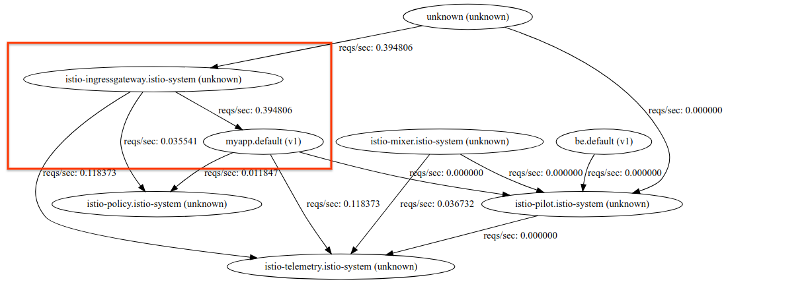
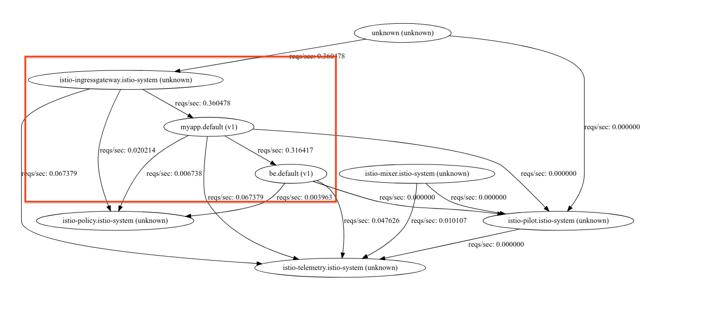
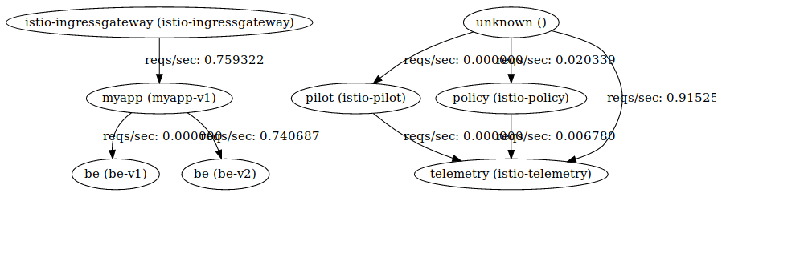
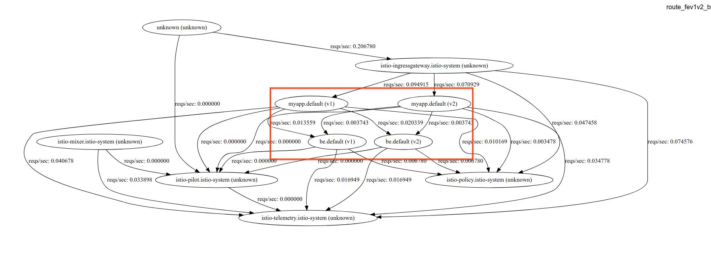

# Istio "Hello World" my way

## What is this repo?

This is a really simple application I wrote over holidays a couple weeks back that detail my experiences and
feedback.  To be clear, its a really, really basic NodeJS application that i used but more importantly, it covers
the main sections of [Istio](https://istio.io/) that i was seeking to understand better (if even just as a helloworld).  

I do know isito has the "[bookinfo](https://github.com/istio/istio/tree/master/samples/bookinfo)" application but the best way
i understand something is to rewrite sections and only those sections from the ground up.

## What i tested

- Basic istio Installation on Google Kubernetes Engine.
- Grafana
- Prometheus
- SourceGraph
- Jaeger
- Route Control
- Destination Rules
- Egress Policies


## What is the app you used?

NodeJS in a Dockerfile...something really minimal.  You can find the entire source under the 'nodeapp' folder in this repo.

The endpoints on this app are as such:

- ```/```:  Does nothing;  ([source](https://github.com/salrashid123/istio_helloworld/blob/master/nodeapp/app.js#L24))
- ```/varz```:  Returns all the environment variables on the current Pod ([source](https://github.com/salrashid123/istio_helloworld/blob/master/nodeapp/app.js#L33))
- ```/version```: Returns just the "process.env.VER" variable that was set on the Deployment ([source](https://github.com/salrashid123/istio_helloworld/blob/master/nodeapp/app.js#L37))
- ```/backend```: Return the nodename, pod name.  Designed to only get called as if the applciation running is a 'backend' ([source](https://github.com/salrashid123/istio_helloworld/blob/master/nodeapp/app.js#L41))
- ```/hostz```:  Does a DNS SRV lookup for the 'backend' and makes an http call to its '/backend', endpoint ([source](https://github.com/salrashid123/istio_helloworld/blob/master/nodeapp/app.js#L45))
- ```/requestz```:  Makes an HTTP fetch for three external URLs (used to show egress rules) ([source](https://github.com/salrashid123/istio_helloworld/blob/master/nodeapp/app.js#L95))


I build and uploaded this app to dockerhub at

```
docker.io/salrashid123/istioinit:1
docker.io/salrashid123/istioinit:2
```
(to simulat two release version of an app ...yeah, theyr'e the same app but during deployment i set an env-var directly):


You're also free to build and push these images directly:
```
docker build  --build-arg VER=1 -t your_dockerhub_id/istioinit:1 .
docker build  --build-arg VER=2 -t your_dockerhub_id/istioinit:2 .

docker push your_dockerhub_id/istioinit:1
docker push your_dockerhub_id/istioinit:2
```

To give you a sense of the differences between a regular GKE specification yaml vs. one modified for istio, you can compare:
- [all-istio.yaml](all-istio.yaml)  vs [all-gke.yaml](all-gke.yaml)
(review Ingress config, etc)

## Lets get started

### Create a 1.9+ GKE Cluster and Bootstrap Istio


```bash

gcloud container  clusters create cluster-1 --cluster-version=1.9.7-gke.1 --zone us-central1-a  --num-nodes 4

gcloud container clusters get-credentials cluster-1 --zone us-central1-a

kubectl create clusterrolebinding cluster-admin-binding --clusterrole=cluster-admin --user=$(gcloud config get-value core/account)

kubectl create ns istio-system

# https://github.com/istio/istio/releases
wget https://github.com/istio/istio/releases/download/0.8.0/istio-0.8.0-linux.tar.gz
tar xvzf istio-0.8.0-linux.tar.gz

# https://github.com/kubernetes/helm/releases
wget https://storage.googleapis.com/kubernetes-helm/helm-v2.9.1-linux-amd64.tar.gz
tar xzvf helm-v2.9.1-linux-amd64.tar.gz

export PATH=$PATH:`pwd`/istio-0.8.0/bin:`pwd`/linux-amd64/

helm template istio-0.8.0/install/kubernetes/helm/istio --name istio --namespace istio-system \
   --set prometheus.enabled=true \
   --set servicegraph.enabled=true \
   --set grafana.enabled=true \
   --set tracing.enabled=true \
   --set sidecar-injector.enabled=true \
   --set global.proxy.image=proxyv2 \
   --set global.mtls.enabled=true > istio.yaml

kubectl create -f istio.yaml
kubectl label namespace default istio-injection=enabled
```

Wait maybe 2 to 3 minutes and make sure all the Deployments are live:

### Make sure the Istio installation is ready

Verify this step by makeing sure all the ```Deployments``` are Available.

```bash
$  kubectl get no,po,rc,svc,ing,deployment -n istio-system
NAME                                          STATUS    ROLES     AGE       VERSION
no/gke-cluster-1-default-pool-e804e7ef-c5sd   Ready     <none>    4m        v1.9.7-gke.1
no/gke-cluster-1-default-pool-e804e7ef-cxgq   Ready     <none>    4m        v1.9.7-gke.1
no/gke-cluster-1-default-pool-e804e7ef-pf8c   Ready     <none>    4m        v1.9.7-gke.1
no/gke-cluster-1-default-pool-e804e7ef-r14v   Ready     <none>    4m        v1.9.7-gke.1

NAME                                           READY     STATUS    RESTARTS   AGE
po/grafana-cd99bf478-8gswx                     1/1       Running   0          2m
po/istio-citadel-ff5696f6f-tmn4z               1/1       Running   0          2m
po/istio-egressgateway-58d98d898c-rbz6c        1/1       Running   0          2m
po/istio-ingress-6fb78f687f-sf7xh              1/1       Running   0          2m
po/istio-ingressgateway-6bc7c7c4bc-gjp6s       1/1       Running   0          2m
po/istio-pilot-6c5c6b586c-8svn6                2/2       Running   0          2m
po/istio-policy-5c7fbb4b9f-5jp4m               2/2       Running   0          2m
po/istio-sidecar-injector-dbd67c88d-fj4kk      1/1       Running   0          2m
po/istio-statsd-prom-bridge-6dbb7dcc7f-qfkz6   1/1       Running   0          2m
po/istio-telemetry-54b5bf4847-4bqhd            2/2       Running   0          2m
po/istio-tracing-67dbb5b89f-7ws5v              1/1       Running   0          2m
po/prometheus-586d95b8d9-rn4br                 1/1       Running   0          2m
po/servicegraph-6d86dfc6cb-trkzj               1/1       Running   0          2m

NAME                           TYPE           CLUSTER-IP      EXTERNAL-IP       PORT(S)                                                               AGE
svc/grafana                    ClusterIP      10.11.253.80    <none>            3000/TCP                                                              2m
svc/istio-citadel              ClusterIP      10.11.254.179   <none>            8060/TCP,9093/TCP                                                     2m
svc/istio-egressgateway        ClusterIP      10.11.254.54    <none>            80/TCP,443/TCP                                                        2m
svc/istio-ingress              LoadBalancer   10.11.245.219   35.224.10.246     80:32000/TCP,443:31768/TCP                                            2m
svc/istio-ingressgateway       LoadBalancer   10.11.252.159   35.232.175.6      80:31380/TCP,443:31390/TCP,31400:31400/TCP                            2m
svc/istio-pilot                ClusterIP      10.11.240.237   <none>            15003/TCP,15005/TCP,15007/TCP,15010/TCP,15011/TCP,8080/TCP,9093/TCP   2m
svc/istio-policy               ClusterIP      10.11.251.101   <none>            9091/TCP,15004/TCP,9093/TCP                                           2m
svc/istio-sidecar-injector     ClusterIP      10.11.244.6     <none>            443/TCP                                                               2m
svc/istio-statsd-prom-bridge   ClusterIP      10.11.249.175   <none>            9102/TCP,9125/UDP                                                     2m
svc/istio-telemetry            ClusterIP      10.11.250.28    <none>            9091/TCP,15004/TCP,9093/TCP,42422/TCP                                 2m
svc/prometheus                 ClusterIP      10.11.245.221   <none>            9090/TCP                                                              2m
svc/servicegraph               ClusterIP      10.11.250.77    <none>            8088/TCP                                                              2m
svc/tracing                    LoadBalancer   10.11.254.122   130.211.117.114   80:30609/TCP                                                          2m
svc/zipkin                     ClusterIP      10.11.249.241   <none>            9411/TCP                                                              2m

NAME                              DESIRED   CURRENT   UP-TO-DATE   AVAILABLE   AGE
deploy/grafana                    1         1         1            1           2m
deploy/istio-citadel              1         1         1            1           2m
deploy/istio-egressgateway        1         1         1            1           2m
deploy/istio-ingress              1         1         1            1           2m
deploy/istio-ingressgateway       1         1         1            1           2m
deploy/istio-pilot                1         1         1            1           2m
deploy/istio-policy               1         1         1            1           2m
deploy/istio-sidecar-injector     1         1         1            1           2m
deploy/istio-statsd-prom-bridge   1         1         1            1           2m
deploy/istio-telemetry            1         1         1            1           2m
deploy/istio-tracing              1         1         1            1           2m
deploy/prometheus                 1         1         1            1           2m
deploy/servicegraph               1         1         1            1           2m

```


### Make sure the Istio an IP for the ```LoadBalancer``` is assigned:

Run

```
kubectl get svc istio-ingressgateway -n istio-system

export GATEWAY_IP=$(kubectl -n istio-system get service istio-ingressgateway -o jsonpath='{.status.loadBalancer.ingress[0].ip}')
echo $GATEWAY_IP
```

Note down the ```$GATEWAY_IP```; we will use this later as the entrypoint into the helloworld app


### Kubernetes Dashboard

You can view the native kubernetes dashboard now.  In 1.9, a couple more steps are required:

```
kubectl create clusterrolebinding kube-dashboard-admin --clusterrole=cluster-admin --serviceaccount=kube-system:kubernetes-dashboard
kubectl describe serviceaccount  kubernetes-dashboard  -n kube-system
```
Insert the token from above

```
kubectl describe secret YOUR-kubernetes-dashboard-token  -n kube-system
```

Then: run ```kubectl proxy```

Finally goto ```http://localhost:8001/ui``` and insert the token here


### Setup some tunnels to each of the services:

Open up three new shell windows and type in one line into each:
```
kubectl -n istio-system port-forward $(kubectl -n istio-system get pod -l app=grafana -o jsonpath='{.items[0].metadata.name}') 3000:3000

kubectl -n istio-system port-forward $(kubectl -n istio-system get pod -l app=servicegraph -o jsonpath='{.items[0].metadata.name}') 8088:8088

kubectl port-forward -n istio-system $(kubectl get pod -n istio-system -l app=jaeger -o jsonpath='{.items[0].metadata.name}') 16686:16686 
```

Open up a browser (three tabs) and go to:
- ServiceGraph http://localhost:8088/force/forcegraph.html
- Grafana http://localhost:3000/dashboard/db/istio-dashboard
- Jaeger http://localhost:16686


### Deploy the sample application 

The default ```all-istio.yaml``` runs:

- Ingress with SSL
- Deployments:
- - myapp-v1:  1 replica
- - myapp-v2:  1 replica
- - be-v1:  1 replicas
- - be-v2:  1 replicas

basically, a default frontend-backend scheme with two replicas each and the same 'v1' verison.

> Note: the default yaml pulls and run my dockerhub image- feel free to change this if you want.


```
$ kubectl create -f all-istio.yaml
```

now use ```istioctl``` to create the ingress-gateway:


```
istioctl create -f istio-ingress-gateway.yaml
```

and then initialize istio on a sample application

```
$ istioctl create -f istio-fev1-bev1.yaml
```

Wait until the deployments complete:

```
$ kubectl get po,deployments,svc,ing
NAME                           READY     STATUS    RESTARTS   AGE
po/be-v1-5bc4cc7f6b-t9rnn      2/2       Running   0          1m
po/be-v2-9dd4cf9b8-fknw9       2/2       Running   0          1m
po/myapp-v1-756b757858-v9f7s   2/2       Running   0          1m
po/myapp-v2-86556c7c8b-2zccg   2/2       Running   0          1m

NAME              DESIRED   CURRENT   UP-TO-DATE   AVAILABLE   AGE
deploy/be-v1      1         1         1            1           1m
deploy/be-v2      1         1         1            1           1m
deploy/myapp-v1   1         1         1            1           1m
deploy/myapp-v2   1         1         1            1           1m

NAME             TYPE        CLUSTER-IP      EXTERNAL-IP   PORT(S)    AGE
svc/be           ClusterIP   10.11.246.122   <none>        8080/TCP   1m
svc/kubernetes   ClusterIP   10.11.240.1     <none>        443/TCP    6m
svc/myapp        ClusterIP   10.11.241.127   <none>        8080/TCP   1m
```

Notice that each pod has two containers:  one is from isto, the other is the applicaiton itself (this is because we have automatic sidecar injection enabled).

Also note that in ```all-istio.yaml``` we did not define an ```Ingress``` object though we've defined a TLS secret with a very specific metadata name: ```istio-ingressgateway-certs```.  That is a special name for a secret that is used by Istio to setup its own ingress gateway:


#### Ingress Gateway Secret in 0.8.0

Note the ```istio-ingress-gateway``` secret specifies the Ingress cert to use (the specific metadata name is special and is **required**)

```yaml
apiVersion: v1
data:
  tls.crt: _redacted_
  tls.key: _redacted_
kind: Secret
metadata:
  name: istio-ingressgateway-certs
  namespace: istio-system
type: kubernetes.io/tls
```

Remember we've acquired the ```$GATEWAY_IP``` earlier:

```
export GATEWAY_IP=$(kubectl -n istio-system get service istio-ingressgateway -o jsonpath='{.status.loadBalancer.ingress[0].ip}')
echo $GATEWAY_IP
```

### Send Traffic 

This section shows basic user->frontend traffic and how serviceGrpah and Grafana consoles:

#### Frontend only

So...lets send traffic with the ip; (the /varz endpoint will send traffic to the frontend service only)

```bash
$ for i in {1..1000}; do curl -k  https://$GATEWAY_IP/version; done
```

You should see a sequence of 1's indicating the version of the frontend ```/version``` you just hit
```
111111111111111111111111111111111
```
(source: [/version](https://github.com/salrashid123/istio_helloworld/blob/master/nodeapp/app.js#L37) endpoint)

You should also see on servicegraph:



and


>> Note, at the time of writing (6/2/18), i've noticed on certain ```istioctl replace``` commands results in the frontend container crashlooping (the istio pods).
I' havent' had time to investigate this yet but for now, if you see ```myapp-v1``` crashlooping as such

```
$ kubectl get po,rc,deployments

NAME                           READY     STATUS             RESTARTS   AGE
po/be-v1-5bc4cc7f6b-j4mjt      2/2       Running            0          11m
po/be-v2-9dd4cf9b8-j6swf       2/2       Running            0          11m
po/myapp-v1-756b757858-js82r   1/2       CrashLoopBackOff   6          11m
po/myapp-v2-86556c7c8b-9x58q   2/2       Running            0          11m

NAME              DESIRED   CURRENT   UP-TO-DATE   AVAILABLE   AGE
deploy/be-v1      1         1         1            1           11m
deploy/be-v2      1         1         1            1           11m
deploy/myapp-v1   1         1         1            0           11m
deploy/myapp-v2   1         1         1            1           11m
```

Rollback first try rolling back the previous ```istioctl replace``` command and after that, delete and recrete the deployment:  ```kubectl delete -f all-istio.yaml``` (I realize i thats not reasonable in production).


#### Frontend and Backend

Now the next step in th exercise:

to send requests to ```user-->frontend--> backend```;  we'll use the applications ```/hostz``` endpoint to do that.

(note i'm using  [jq](https://stedolan.github.io/jq/) utility to parse JSON)

```
$ for i in {1..1000}; do curl -s -k https://$GATEWAY_IP/hostz | jq '.[0].body'; done
```

you should see output indicating traffic from the v1 backend verison: ```be-v1-*```

```
$ for i in {1..1000}; do curl -s -k https://$GATEWAY_IP/hostz | jq '.[0].body'; done
"pod: [be-v1-5bc4cc7f6b-t9rnn]    node: [gke-cluster-1-default-pool-195daff5-6nfs]"
"pod: [be-v1-5bc4cc7f6b-t9rnn]    node: [gke-cluster-1-default-pool-195daff5-6nfs]"
"pod: [be-v1-5bc4cc7f6b-t9rnn]    node: [gke-cluster-1-default-pool-195daff5-6nfs]"
"pod: [be-v1-5bc4cc7f6b-t9rnn]    node: [gke-cluster-1-default-pool-195daff5-6nfs]"
"pod: [be-v1-5bc4cc7f6b-t9rnn]    node: [gke-cluster-1-default-pool-195daff5-6nfs]"
"pod: [be-v1-5bc4cc7f6b-t9rnn]    node: [gke-cluster-1-default-pool-195daff5-6nfs]"
```

Note both ServiceGraph and Grafana shows both frontend and backend service telemetry:




## Route Control

This section details how to slectively send traffic to service ```versions```

### Selective Traffic

In this sequence,  we will setup a routecontrol to:

1. Send all traffic to ```myapp:v1```.  
2. traffic from ```myapp:v1``` to be can only go to ```be:v2```

The yaml on ```istio-fev1-bev2.yaml``` would direct inbound traffic for ```myapp:v1``` to go to ```be:v2``` (note the ```sourceLabels:``` part that specifies requests inbound from ```myapp:v1```).  The snippet for this config is:

```yaml
apiVersion: networking.istio.io/v1alpha3
kind: VirtualService
metadata:
  name: be-virtualservice
spec:
  gateways:
  - mesh 
  hosts:
  - be.default.svc.cluster.local
  http:
  - match:
    - sourceLabels:
        app: myapp
        version: v1 
    route:
    - destination:
        host: be.default.svc.cluster.local
        subset: v2
      weight: 100
---
apiVersion: networking.istio.io/v1alpha3
kind: DestinationRule
metadata:
  name: be-destination
spec:
  host: be.default.svc.cluster.local
  trafficPolicy:
    tls:
      mode: ISTIO_MUTUAL
    loadBalancer:
      simple: ROUND_ROBIN
  subsets:
  - name: v1
    labels:
      version: v1
  - name: v2
    labels:
      version: v2
```

Then setup the config with istioctl:

```
istioctl replace -f istio-fev1-bev2.yaml
```

After sending traffic to check which backend system was called ```/hostz```, we see responses from only ```be-v2-*```.
What the ```/hosts``` endpoint does is takes a users request to ```fe-*``` and targets any ```be-*```.  Since we only have ```fe-v1``` instances
running, the traffic outbound for ```be-*``` must terminate at a ```be-v1``` version given the rule above:

```
$ for i in {1..1000}; do curl -s -k https://$GATEWAY_IP/hostz | jq '.[0].body'; done
"pod: [be-v2-9dd4cf9b8-fknw9]    node: [gke-cluster-1-default-pool-195daff5-r65j]"
"pod: [be-v2-9dd4cf9b8-fknw9]    node: [gke-cluster-1-default-pool-195daff5-r65j]"
"pod: [be-v2-9dd4cf9b8-fknw9]    node: [gke-cluster-1-default-pool-195daff5-r65j]"
"pod: [be-v2-9dd4cf9b8-fknw9]    node: [gke-cluster-1-default-pool-195daff5-r65j]"
"pod: [be-v2-9dd4cf9b8-fknw9]    node: [gke-cluster-1-default-pool-195daff5-r65j]"
```

and on the frontend version is always one.
```
$ for i in {1..100}; do curl -k https://$GATEWAY_IP/version; done
11111111111111111111111111111
```




If we now overlay rules that direct traffic allow interleaved  fe(v1|v2) -> be(v1|v2) we expect to see requests to both frontend v1 and backend
```
istioctl replace -f istio-fev1v2-bev1v2.yaml
```

then frontend is both v1 and v2:
```
$ for i in {1..1000}; do curl -k  https://$GATEWAY_IP/version; done
111211112122211121212211122211
```

and backend is responses comes from both be-v1 and be-v2

```
$ for i in {1..1000}; do curl -s -k https://$GATEWAY_IP/hostz | jq '.[0].body'; done
"pod: [be-v1-5bc4cc7f6b-t9rnn]    node: [gke-cluster-1-default-pool-195daff5-6nfs]"
"pod: [be-v2-9dd4cf9b8-fknw9]    node: [gke-cluster-1-default-pool-195daff5-r65j]"
"pod: [be-v2-9dd4cf9b8-fknw9]    node: [gke-cluster-1-default-pool-195daff5-r65j]"
"pod: [be-v2-9dd4cf9b8-fknw9]    node: [gke-cluster-1-default-pool-195daff5-r65j]"
"pod: [be-v2-9dd4cf9b8-fknw9]    node: [gke-cluster-1-default-pool-195daff5-r65j]"
"pod: [be-v2-9dd4cf9b8-fknw9]    node: [gke-cluster-1-default-pool-195daff5-r65j]"
"pod: [be-v2-9dd4cf9b8-fknw9]    node: [gke-cluster-1-default-pool-195daff5-r65j]"
"pod: [be-v1-5bc4cc7f6b-t9rnn]    node: [gke-cluster-1-default-pool-195daff5-6nfs]"
"pod: [be-v1-5bc4cc7f6b-t9rnn]    node: [gke-cluster-1-default-pool-195daff5-6nfs]"
"pod: [be-v2-9dd4cf9b8-fknw9]    node: [gke-cluster-1-default-pool-195daff5-r65j]"
"pod: [be-v1-5bc4cc7f6b-t9rnn]    node: [gke-cluster-1-default-pool-195daff5-6nfs]"
```




### Route Path

Now lets setup a more selective route based on a specific path in the URI:

- Route requests to myapp where path=/version to only v1
  A request to http://gateway_ip/version will go to v1 only


```yaml
---
apiVersion: networking.istio.io/v1alpha3
kind: VirtualService
metadata:
  name: myapp-virtualservice
spec:
  hosts:
  - "*"
  gateways:
  - my-gateway
  http:
  - match: 
    - uri:
        exact: /version
    route:
    - destination:
        host: myapp.default.svc.cluster.local
        subset: v1
  - route: 
    - destination:
        host: myapp.default.svc.cluster.local
        subset: v1
      weight: 20
    - destination:
        host: myapp.default.svc.cluster.local
        subset: v2
      weight: 80
```


```
istioctl replace -f istio-route-version-fev1-bev1v2.yaml
```

```
$ for i in {1..1000}; do curl -k  https://$GATEWAY_IP/version; done
1111111111111111111
```

You may have noted how the route to the destination is weighted split vs delcared round robin (eg:)
```yaml
  - route: 
    - destination:
        host: myapp.default.svc.cluster.local
        subset: v1
      weight: 20
    - destination:
        host: myapp.default.svc.cluster.local
        subset: v2
      weight: 80
```

Normally, you can use that destination rule to split traffic between services alltogether (eg, in real life you may have):
```yaml
  - route: 
    - destination:
        host: app1.default.svc.cluster.local
        subset: v1
      weight: 50
    - destination:
        host: app2.default.svc.cluster.local
        subset: v10
      weight: 50
```

which for any other endpoint other than endpoint other thatn ```/version```, each request is split 50/50 between two destination services (```app1``` and ```app2```)


Anyway, now lets edit rule to  and change the prefix match to ```/xversion``` so the match doesn't apply 
  A request to http://gateway_ip/version will go to v1 and v2 (since the path rule did not match)

Once you make this change, use ```istioctl``` to make the change happen

```
istioctl replace -f istio-route-version-fev1-bev1v2.yaml
```


```kubectl delete -f all-istio.yaml```

```
$ for i in {1..1000}; do curl -k  https://$GATEWAY_IP/version; done
2121212222222222222221122212211222222222222222
```

What you're seeing is ```myapp-v1``` now getting about 20% of the traffic while ```myapp-v2``` gets 80%

### Destination Rules

These rules sends all traffic from ```myapp-v1``` round-robin to both version of the backend.

First lets  force all gateway requests to go to ```v1``` only:

on ```istio-fev1-bev1v2.yaml```:


```yaml
apiVersion: networking.istio.io/v1alpha3
kind: VirtualService
metadata:
  name: myapp-virtualservice
spec:
  hosts:
  - "*"
  gateways:
  - my-gateway
  http:
  - route:
    - destination:
        host: myapp.default.svc.cluster.local
        subset: v1
```


And where the backend trffic is split between ```be-v1``` and ```be-v2``` with a ```ROUND_ROBIN```

```yaml
apiVersion: networking.istio.io/v1alpha3
kind: DestinationRule
metadata:
  name: be-destination
spec:
  host: be.default.svc.cluster.local
  trafficPolicy:
    tls:
      mode: ISTIO_MUTUAL
    loadBalancer:
      simple: ROUND_ROBIN
  subsets:
  - name: v1
    labels:
      version: v1
  - name: v2
    labels:
      version: v2
```

After you apply the rule, 

```
istioctl replace -f istio-fev1-bev1v2.yaml
```

you'll see frontend request all going to ```fe-v1```

```
$ for i in {1..1000}; do curl -k  https://$GATEWAY_IP/version; done
11111111111111
```

with backend requests coming from pretty much round robin

```bash
$ for i in {1..1000}; do curl -s -k https://$GATEWAY_IP/hostz | jq '.[0].body'; done
"pod: [be-v1-5bc4cc7f6b-pqpkf]    node: [gke-cluster-1-default-pool-195daff5-5sfm]"
"pod: [be-v2-9dd4cf9b8-q7zbn]    node: [gke-cluster-1-default-pool-195daff5-r8pl]"
"pod: [be-v1-5bc4cc7f6b-pqpkf]    node: [gke-cluster-1-default-pool-195daff5-5sfm]"
"pod: [be-v2-9dd4cf9b8-q7zbn]    node: [gke-cluster-1-default-pool-195daff5-r8pl]"
"pod: [be-v1-5bc4cc7f6b-pqpkf]    node: [gke-cluster-1-default-pool-195daff5-5sfm]"
"pod: [be-v2-9dd4cf9b8-q7zbn]    node: [gke-cluster-1-default-pool-195daff5-r8pl]"
"pod: [be-v1-5bc4cc7f6b-pqpkf]    node: [gke-cluster-1-default-pool-195daff5-5sfm]"
"pod: [be-v2-9dd4cf9b8-q7zbn]    node: [gke-cluster-1-default-pool-195daff5-r8pl]"
"pod: [be-v1-5bc4cc7f6b-pqpkf]    node: [gke-cluster-1-default-pool-195daff5-5sfm]"
"pod: [be-v2-9dd4cf9b8-q7zbn]    node: [gke-cluster-1-default-pool-195daff5-r8pl]"
"pod: [be-v1-5bc4cc7f6b-pqpkf]    node: [gke-cluster-1-default-pool-195daff5-5sfm]"
"pod: [be-v2-9dd4cf9b8-q7zbn]    node: [gke-cluster-1-default-pool-195daff5-r8pl]"
"pod: [be-v1-5bc4cc7f6b-pqpkf]    node: [gke-cluster-1-default-pool-195daff5-5sfm]"
"pod: [be-v2-9dd4cf9b8-q7zbn]    node: [gke-cluster-1-default-pool-195daff5-r8pl]"
"pod: [be-v1-5bc4cc7f6b-pqpkf]    node: [gke-cluster-1-default-pool-195daff5-5sfm]"
"pod: [be-v2-9dd4cf9b8-q7zbn]    node: [gke-cluster-1-default-pool-195daff5-r8pl]"
"pod: [be-v1-5bc4cc7f6b-pqpkf]    node: [gke-cluster-1-default-pool-195daff5-5sfm]"
"pod: [be-v2-9dd4cf9b8-q7zbn]    node: [gke-cluster-1-default-pool-195daff5-r8pl]"
"pod: [be-v1-5bc4cc7f6b-pqpkf]    node: [gke-cluster-1-default-pool-195daff5-5sfm]"
"pod: [be-v2-9dd4cf9b8-q7zbn]    node: [gke-cluster-1-default-pool-195daff5-r8pl]"
"pod: [be-v1-5bc4cc7f6b-pqpkf]    node: [gke-cluster-1-default-pool-195daff5-5sfm]"

```

Now change the ```istio-fev1-bev1v2.yaml```  to ```RANDOM``` and see response is from v1 and v2 random:
```bash
$ for i in {1..1000}; do curl -s -k https://$GATEWAY_IP/hostz | jq '.[0].body'; done
"pod: [be-v2-9dd4cf9b8-q7zbn]    node: [gke-cluster-1-default-pool-195daff5-r8pl]"
"pod: [be-v2-9dd4cf9b8-q7zbn]    node: [gke-cluster-1-default-pool-195daff5-r8pl]"
"pod: [be-v1-5bc4cc7f6b-pqpkf]    node: [gke-cluster-1-default-pool-195daff5-5sfm]"
"pod: [be-v1-5bc4cc7f6b-pqpkf]    node: [gke-cluster-1-default-pool-195daff5-5sfm]"
"pod: [be-v1-5bc4cc7f6b-pqpkf]    node: [gke-cluster-1-default-pool-195daff5-5sfm]"
"pod: [be-v1-5bc4cc7f6b-pqpkf]    node: [gke-cluster-1-default-pool-195daff5-5sfm]"
"pod: [be-v2-9dd4cf9b8-q7zbn]    node: [gke-cluster-1-default-pool-195daff5-r8pl]"
"pod: [be-v1-5bc4cc7f6b-pqpkf]    node: [gke-cluster-1-default-pool-195daff5-5sfm]"
"pod: [be-v1-5bc4cc7f6b-pqpkf]    node: [gke-cluster-1-default-pool-195daff5-5sfm]"
"pod: [be-v2-9dd4cf9b8-q7zbn]    node: [gke-cluster-1-default-pool-195daff5-r8pl]"
"pod: [be-v1-5bc4cc7f6b-pqpkf]    node: [gke-cluster-1-default-pool-195daff5-5sfm]"
"pod: [be-v2-9dd4cf9b8-q7zbn]    node: [gke-cluster-1-default-pool-195daff5-r8pl]"
"pod: [be-v1-5bc4cc7f6b-pqpkf]    node: [gke-cluster-1-default-pool-195daff5-5sfm]"
"pod: [be-v2-9dd4cf9b8-q7zbn]    node: [gke-cluster-1-default-pool-195daff5-r8pl]"
"pod: [be-v2-9dd4cf9b8-q7zbn]    node: [gke-cluster-1-default-pool-195daff5-r8pl]"
"pod: [be-v1-5bc4cc7f6b-pqpkf]    node: [gke-cluster-1-default-pool-195daff5-5sfm]"
"pod: [be-v1-5bc4cc7f6b-pqpkf]    node: [gke-cluster-1-default-pool-195daff5-5sfm]"
"pod: [be-v2-9dd4cf9b8-q7zbn]    node: [gke-cluster-1-default-pool-195daff5-r8pl]"
"pod: [be-v1-5bc4cc7f6b-pqpkf]    node: [gke-cluster-1-default-pool-195daff5-5sfm]"
"pod: [be-v2-9dd4cf9b8-q7zbn]    node: [gke-cluster-1-default-pool-195daff5-r8pl]"
"pod: [be-v2-9dd4cf9b8-q7zbn]    node: [gke-cluster-1-default-pool-195daff5-r8pl]"
"pod: [be-v2-9dd4cf9b8-q7zbn]    node: [gke-cluster-1-default-pool-195daff5-r8pl]"
"pod: [be-v2-9dd4cf9b8-q7zbn]    node: [gke-cluster-1-default-pool-195daff5-r8pl]"
"pod: [be-v2-9dd4cf9b8-q7zbn]    node: [gke-cluster-1-default-pool-195daff5-r8pl]"
"pod: [be-v1-5bc4cc7f6b-pqpkf]    node: [gke-cluster-1-default-pool-195daff5-5sfm]"
"pod: [be-v2-9dd4cf9b8-q7zbn]    node: [gke-cluster-1-default-pool-195daff5-r8pl]"
"pod: [be-v2-9dd4cf9b8-q7zbn]    node: [gke-cluster-1-default-pool-195daff5-r8pl]"
"pod: [be-v1-5bc4cc7f6b-pqpkf]    node: [gke-cluster-1-default-pool-195daff5-5sfm]"
"pod: [be-v1-5bc4cc7f6b-pqpkf]    node: [gke-cluster-1-default-pool-195daff5-5sfm]"

```

### Egress Rules


Egress rules prevent outbound calls from the server except with whiteliste addresses.

For example:

```yaml
apiVersion: networking.istio.io/v1alpha3
kind: ServiceEntry
metadata:
  name: bbc-ext
spec:
  hosts:
  - www.bbc.com
  ports:
  - number: 443
    name: https
    protocol: HTTP
---
apiVersion: networking.istio.io/v1alpha3
kind: DestinationRule
metadata:
  name: bbc-ext
spec:
  host: www.bbc.com
  trafficPolicy:
    tls:
      mode: SIMPLE
```


Allows only ```https://www.bbc.com/*``` but here is the catch:  you must change your code in the container to make a call to

```http://www.bbc.com:443```  (NOTE the protocol is different)

This is pretty unusable ..futurue releases of egress+istio will use SNI so users do not have to change their client code like this.

Anyway, to test, the `/hostz` endpoint tries to fetch the following URLs:

```javascript
    var urls = [
                'http://www.cnn.com:443/',
                'http://www.bbc.com:443/robots.txt',
                'https://www.bbc.com/robots.txt',
    ]
```

Lets setup this customer for these egress rules.

First make sure there is an inbound rule already running:

```
istioctl replace -f istio-fev1-bev1.yaml
```

then apply the egress policy:

```
istioctl create -f istio-egress-rule.yaml
```


- Without egress rule, each request will fail:

```
$ $ curl -k -s  https://$GATEWAY_IP/requestz | jq  '.'
```

gives

```
[
  {
    "url": "http:\/\/www.cnn.com:443\/",
    "statusCode": {
      "name": "RequestError",
      "message": "Error: read ECONNRESET",
  {
    "url": "http:\/\/www.bbc.com:443\/robots.txt",
    "statusCode": {
      "name": "RequestError",
      "message": "Error: read ECONNRESET",
  {
    "url": "https:\/\/www.bbc.com\/robots.txt",
    "statusCode": {
      "name": "RequestError",
      "message": "Error: read ECONNRESET",
```

#### With egress rule

```
istioctl create -f egress-rule.yaml
```

gives

```bash
$ curl -s -k https://$GATEWAY_IP/requestz | jq  '.'
[
  {
    "url": "http://www.cnn.com:443/",
    "body": "",
    "statusCode": 404
  },
  {
    "url": "http://www.bbc.com:443/robots.txt",
    "body": "# v.4.7.4\n# HTTPS  www.bbc.com\nUser-agent: *\nSitemap: https://www.bbc.com/sitemaps/https-index-com-archive.xml\nSitemap: https://www.bbc.com/sitemaps/https-index-com-news.xml\n\n\nDisallow: /cbbc/search/\nDisallow: /cbbc/search$\nDisallow: /cbbc/search?\nDisallow: /cbeebies/search/\nDisallow: /cbeebies/search$\nDisallow: /cbeebies/search?\nDisallow: /chwilio/\nDisallow: /chwilio$\nDisallow: /chwilio?\nDisallow: /education/blocks$\nDisallow: /education/blocks/\nDisallow: /newsround\nDisallow: /search/\nDisallow: /search$\nDisallow: /search?\nDisallow: /food/favourites\nDisallow: /food/recipes/search*?*",
    "statusCode": 200
  },
  {
    "url": "https://www.bbc.com/robots.txt",
    "statusCode": {
      "name": "RequestError",
      "message": "Error: write EPROTO 140312253028160:error:140770FC:SSL routines:SSL23_GET_SERVER_HELLO:unknown protocol:../deps/openssl/openssl/ssl/s23_clnt.c:827:\n",
      "cause": {
        "errno": "EPROTO",
        "code": "EPROTO",
        "syscall": "write"
      },
      "error": {
        "errno": "EPROTO",
        "code": "EPROTO",
        "syscall": "write"
      },
      "options": {
        "method": "GET",
        "uri": "https://www.bbc.com/robots.txt",
        "resolveWithFullResponse": true,
        "simple": false,
        "transform2xxOnly": false
      }
    }
  }
]

```

Notice that only one of the hosts worked over SSL worked

## Cleanup

The easiest way to clean up what you did here is to delete the GKE cluster!

```
gcloud container clusters delete cluster-1
```

## Conclusion

The steps i outlined above is just a small set of what Istio has in store.  I'll keep updating this as it move towards ```1.0``` and subsequent releases.

If you find any are for improvements, please submit a comment or git issue in this [repo](https://github.com/salrashid123/istio_helloworld),.
---