# Istio "Hello World" my way

## What is this repo?

This is a really simple application I wrote over holidays a couple weeks back that detail my experiences and
feedback.  To be clear, its a really, really basic NodeJS application that i used but more importantly, it covers
the main sections of [Istio](https://istio.io/) that i was seeking to understand better (if even just as a helloworld).  

I do know isito has the "[bookinfo](https://github.com/istio/istio/tree/master/samples/bookinfo)" application but the best way
i understand something is to rewrite sections and only those sections from the ground up.

## What i tested

- Basic istio Installation on Google Kubernetes Engine.
- Grafana
- Prometheus
- SourceGraph
- Zipkin
- Route Control
- Destination Rules
- Egress Policies


## What is the app you used?

NodeJS in a Dockerfile...something really minimal.  You can find the entire source under the 'nodeapp' folder in this repo.

The endpoints on this app are as such:

- ```/```:  Does nothing;
- ```/varz```:  Returns all the environment variables on the current Pod
- ```/version```: Returns just the "process.env.VER" variable that was set on the Deployment
- ```/backend```: Return the nodename, pod name.  Designed to only get called as if the applciation running is a 'backend' 
- ```/hostz```:  Does a DNS SRV lookup for the 'backend' and makes an http call to its '/backend', endpoint
- ```/requestz```:  Makes an HTTP fetch for three external URLs (used to show egress rules)


I build and uploaded this app to dockerhub at

```
docker.io/salrashid123/istioinit:1
docker.io/salrashid123/istioinit:2
```
(to simulat two release version of an app ...yeah, theyr'e the same app but during deployment i set an env-var directly):


You're also free to build and push these images directly:
```
docker build  --build-arg VER=1 -t your_dockerhub_id/istioinit:1 .
docker build  --build-arg VER=2 -t your_dockerhub_id/istioinit:2 .

docker push your_dockerhub_id/istioinit:1
docker push your_dockerhub_id/istioinit:2
```

To give you a sense of the differences between a regular GKE specification yaml vs. one modified for istio, you can compare:
- [all-istio.yaml](all-istio.yaml)  vs [all-gke.yaml](all-gke.yaml)
(review Ingress config, etc)

## Lets get started

### Create a 1.9+ GKE Cluster and Bootstrap Istio


```bash

gcloud container  clusters create cluster-1     --cluster-version=1.9.7-gke.0  --zone us-central1-a  --num-nodes 3
gcloud container clusters list
gcloud container clusters get-credentials cluster-1 --zone us-central1-a

kubectl api-versions | grep admissionregistration

kubectl create clusterrolebinding cluster-admin-binding --clusterrole=cluster-admin --user=$(gcloud config get-value core/account)

wget https://github.com/istio/istio/releases/download/0.7.0/istio-0.7.0-linux.tar.gz

tar xvf istio-0.7.0-linux.tar.gz 
cd istio-0.7.0/

kubectl create -f install/kubernetes/istio.yaml


./install/kubernetes/webhook-create-signed-cert.sh \
    --service istio-sidecar-injector \
    --namespace istio-system \
    --secret sidecar-injector-certs

kubectl apply -f install/kubernetes/istio-sidecar-injector-configmap-release.yaml


cat install/kubernetes/istio-sidecar-injector.yaml | \
     ./install/kubernetes/webhook-patch-ca-bundle.sh > \
     install/kubernetes/istio-sidecar-injector-with-ca-bundle.yaml

kubectl apply --filename=install/kubernetes/istio-sidecar-injector-with-ca-bundle.yaml

kubectl -n istio-system get deployment -listio=sidecar-injector

kubectl label namespace default istio-injection=enabled

kubectl get namespace -L istio-injection
```

Now its time to install for addon:

```
kubectl apply -f install/kubernetes/addons/prometheus.yaml
kubectl apply -f install/kubernetes/addons/grafana.yaml
kubectl apply -f install/kubernetes/addons/zipkin.yaml
kubectl apply -f install/kubernetes/addons/servicegraph.yaml
```


### Make sure the Istio installation is ready

```bash
$ kubectl get no,po,deployments,svc -n istio-system
NAME                                          STATUS    ROLES     AGE       VERSION
no/gke-cluster-1-default-pool-cc917931-hxtx   Ready     <none>    6m        v1.9.7-gke.0
no/gke-cluster-1-default-pool-cc917931-kdcg   Ready     <none>    6m        v1.9.7-gke.0
no/gke-cluster-1-default-pool-cc917931-xv32   Ready     <none>    6m        v1.9.7-gke.0

NAME                                         READY     STATUS    RESTARTS   AGE
po/grafana-5cf49d7546-4jbtj                  1/1       Running   0          2m
po/istio-ca-6ccdfb9986-crmss                 1/1       Running   0          3m
po/istio-ingress-dcbc79cdd-rrg5z             1/1       Running   0          3m
po/istio-mixer-779454485-6rbkz               3/3       Running   0          3m
po/istio-pilot-5d54d856b6-mzkl4              2/2       Running   0          3m
po/istio-sidecar-injector-56bc694c8c-rj2h2   1/1       Running   0          3m
po/prometheus-cf8456855-jl6bk                1/1       Running   0          2m
po/servicegraph-7d64f47f6d-rt7bj             1/1       Running   0          2m
po/zipkin-7988c559b7-7v9sd                   1/1       Running   0          2m

NAME                            DESIRED   CURRENT   UP-TO-DATE   AVAILABLE   AGE
deploy/grafana                  1         1         1            1           2m
deploy/istio-ca                 1         1         1            1           3m
deploy/istio-ingress            1         1         1            1           3m
deploy/istio-mixer              1         1         1            1           3m
deploy/istio-pilot              1         1         1            1           3m
deploy/istio-sidecar-injector   1         1         1            1           3m
deploy/prometheus               1         1         1            1           2m
deploy/servicegraph             1         1         1            1           2m
deploy/zipkin                   1         1         1            1           2m

NAME                         TYPE           CLUSTER-IP      EXTERNAL-IP      PORT(S)                                                             AGE
svc/grafana                  ClusterIP      10.11.243.111   <none>           3000/TCP                                                            2m
svc/istio-ingress            LoadBalancer   10.11.240.239   35.192.159.161   80:30077/TCP,443:32459/TCP                                          3m
svc/istio-mixer              ClusterIP      10.11.245.106   <none>           9091/TCP,15004/TCP,9093/TCP,9094/TCP,9102/TCP,9125/UDP,42422/TCP    3m
svc/istio-pilot              ClusterIP      10.11.252.21    <none>           15003/TCP,15005/TCP,15007/TCP,15010/TCP,8080/TCP,9093/TCP,443/TCP   3m
svc/istio-sidecar-injector   ClusterIP      10.11.242.134   <none>           443/TCP                                                             3m
svc/prometheus               ClusterIP      10.11.254.137   <none>           9090/TCP                                                            2m
svc/servicegraph             ClusterIP      10.11.253.245   <none>           8088/TCP                                                            2m
svc/zipkin                   ClusterIP      10.11.250.207   <none>           9411/TCP                                                            2m
```


### Kubernetes Dashboard

You can view the native kubernetes dashboard now.  In 1.9, a couple more steps are required:

```
kubectl create clusterrolebinding kube-dashboard-admin --clusterrole=cluster-admin --serviceaccount=kube-system:kubernetes-dashboard
kubectl describe serviceaccount  kubernetes-dashboard  -n kube-system
```
Insert the token from above

```
kubectl describe secret YOUR-kubernetes-dashboard-token  -n kube-system
```

Then: run ```kubectl proxy```

Finally goto ```http://localhost:8001/ui``` and insert the token here


### Setup some tunnels to each of the services:

Open up three new shell windows and type in one line into each:
```
kubectl -n istio-system port-forward $(kubectl -n istio-system get pod -l app=grafana -o jsonpath='{.items[0].metadata.name}') 3000:3000

kubectl -n istio-system port-forward $(kubectl -n istio-system get pod -l app=servicegraph -o jsonpath='{.items[0].metadata.name}') 8088:8088

kubectl port-forward -n istio-system $(kubectl get pod -n istio-system -l app=zipkin -o jsonpath='{.items[0].metadata.name}') 9411:9411
```

Open up a browser (three tabs) and go to:
- ServiceGraph http://localhost:8088/dotviz
- Grafana http://localhost:3000/dashboard/db/istio-dashboard
- Zipkin http://localhost:9411


### Deploy the sample application 

The default ```all-istio.yaml``` runs:

- Ingress with SSL
- Deployments:
- - myapp-v1:  2 replicas
- - be-v1:  2 replicas

basically, a default frontend-backend scheme with two replicas each and the same 'v1' verison.

> Note: the default yaml pulls and run my dockerhub image- feel free to change this if you want.


```
$ kubectl create -f all-istio.yaml

$ kubectl get po,deployments,svc,ing 

NAME                           READY     STATUS    RESTARTS   AGE
po/be-v1-5bc4cc7f6b-lqqrk      2/2       Running   0          1m
po/myapp-v1-5bcff7b6d6-mrm9p   2/2       Running   0          2m

NAME              DESIRED   CURRENT   UP-TO-DATE   AVAILABLE   AGE
deploy/be-v1      1         1         1            1           2m
deploy/be-v2      0         0         0            0           2m
deploy/myapp-v1   1         1         1            1           2m
deploy/myapp-v2   0         0         0            0           2m

NAME             TYPE        CLUSTER-IP     EXTERNAL-IP   PORT(S)    AGE
svc/be           ClusterIP   10.11.240.44   <none>        8080/TCP   2m
svc/kubernetes   ClusterIP   10.11.240.1    <none>        443/TCP    11m
svc/myapp        ClusterIP   10.11.250.95   <none>        8080/TCP   2m

NAME          HOSTS     ADDRESS          PORTS     AGE
ing/gateway   *         35.192.159.161   80, 443   2m
```

Notice that each pod has two containers:  one is from isto, the other is the applicaiton itself (this is because we have automatic sidecar injection enabled).

Also note the Ingress IP address (in my case, its ```35.192.159.161```).  Set this as the GATEWAY_IP

```
export GATEWAY_IP=35.192.159.161
```

### Send Traffic 

#### Frontend only

(send traffic with the ip; the /varz endpoint will send traffic from frontend service only)

```bash
for i in {1..1000}; do curl -k -o /dev/null -s -w "%{http_code}\n" https://$GATEWAY_IP/varz; done
```

You should see '200' ok  (try it out in a browser too to see the env/variables set in the cluster)

You should also see:

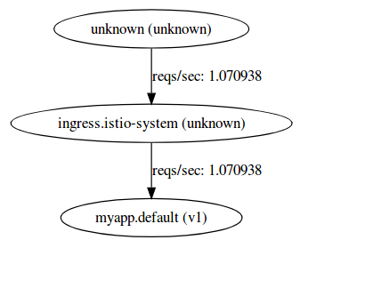

and

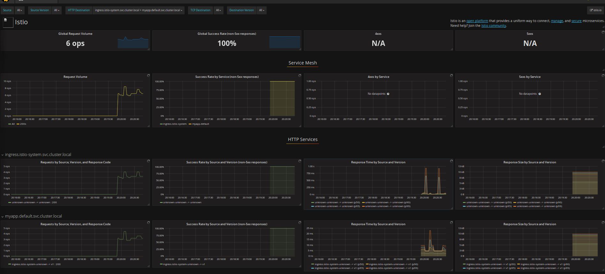


A couple of (emperical) notes:

- Impact of liveness probe:

If you uncomment the following in the YAML file and run the whole test again from scratch, Istio's ServiceGraph sees the liveness probe itself..

(> Note:  you don't have to run this step.  Once you uncomment and send some traffic, the service graphs will continue to render and display historic
traffic it sees (i don't know how to regenerate it from scratch; if you do, submit an issue please!).

If you do choose to run this, please delete the istio cluster and recreate it...otherwise, just take my word and skip this!)

```yaml
        - containerPort: 8080
        livenessProbe:
          httpGet:
            path: /_ah/health
            port: 8080
          initialDelaySeconds: 30
          timeoutSeconds: 1
```

```
$ kubectl get po,deployments,svc,ing 
NAME                           READY     STATUS    RESTARTS   AGE
po/be-v1-16151855-4vsz5        2/2       Running   0          25s
po/be-v1-16151855-cxvxw        2/2       Running   0          25s
po/myapp-v1-2518991625-3z1pv   2/2       Running   0          25s
po/myapp-v1-2518991625-crc7s   2/2       Running   0          25s

NAME              DESIRED   CURRENT   UP-TO-DATE   AVAILABLE   AGE
deploy/be-v1      2         2         2            2           25s
deploy/be-v2      0         0         0            0           25s
deploy/myapp-v1   2         2         2            2           25s
deploy/myapp-v2   0         0         0            0           25s

NAME             TYPE        CLUSTER-IP     EXTERNAL-IP   PORT(S)    AGE
svc/be           ClusterIP   10.11.240.44   <none>        8080/TCP   2m
svc/kubernetes   ClusterIP   10.11.240.1    <none>        443/TCP    11m
svc/myapp        ClusterIP   10.11.250.95   <none>        8080/TCP   2m

NAME          HOSTS     ADDRESS         PORTS     AGE
ing/gateway   *         35.192.159.161  80, 443   25s
```
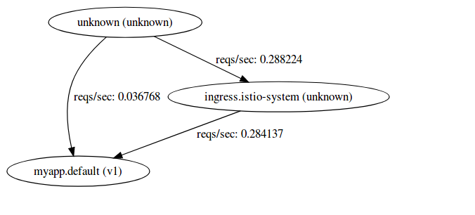


- Ingress-Service-Deployment Labels

Note that the service and deployment labels are all precisely the same ("app=myapp").  More accurately, if you just set the ingress->service names to 
```serviceName:my-srv``` as sown below:

Ingress

```yaml
apiVersion: extensions/v1beta1
kind: Ingress
metadata:
  name: gateway
  annotations:
    kubernetes.io/ingress.class: "istio"
    kubernetes.io/ingress.allowHTTP: "false"
spec:
  tls:
  - secretName: istio-ingress-certs
  rules:
  - http:
      paths:
      - path: /.*
        backend:
          serviceName: myapp-srv
          servicePort: 8080
```

Service:
```yaml
apiVersion: v1
kind: Service
metadata:
  name: myapp-srv
  labels:
    app: myapp
spec:
  ports:
  - port: 8080
    name: http
  selector:
    app: myapp
```

Deployment:
```yaml
apiVersion: extensions/v1beta1
kind: Deployment
metadata:
  name: myapp-v1
spec:
  replicas: 2
  template:
    metadata:
      labels:
        app: myapp
        version: v1
```


```bash
$ kubectl get po,deployments,svc,ing 
NAME                           READY     STATUS    RESTARTS   AGE
po/be-v1-16151855-7lfrd        2/2       Running   0          33m
po/be-v1-16151855-z50n2        2/2       Running   0          33m
po/myapp-v1-2518991625-frfd9   2/2       Running   0          33m
po/myapp-v1-2518991625-vhh6x   2/2       Running   0          33m

NAME              DESIRED   CURRENT   UP-TO-DATE   AVAILABLE   AGE
deploy/be-v1      2         2         2            2           33m
deploy/be-v2      0         0         0            0           33m
deploy/myapp-v1   2         2         2            2           33m
deploy/myapp-v2   0         0         0            0           33m

NAME             TYPE        CLUSTER-IP     EXTERNAL-IP   PORT(S)    AGE
svc/be           ClusterIP   10.11.240.44   <none>        8080/TCP   2m
svc/kubernetes   ClusterIP   10.11.240.1    <none>        443/TCP    11m
svc/myapp        ClusterIP   10.11.250.95   <none>        8080/TCP   2m

NAME          HOSTS     ADDRESS         PORTS     AGE
ing/gateway   *         35.192.159.161   80, 443   33m
```

.you'll see serviceGraph mismatches service graph matches to ```myapp-srv``` displays the target service itself.


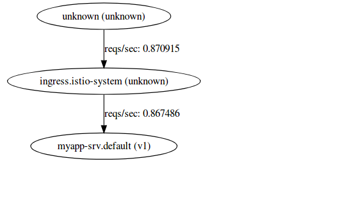

> **BUT** Grafana displays just the ingress and no traffic to ```myapp.default.svc.cluster.local``` 

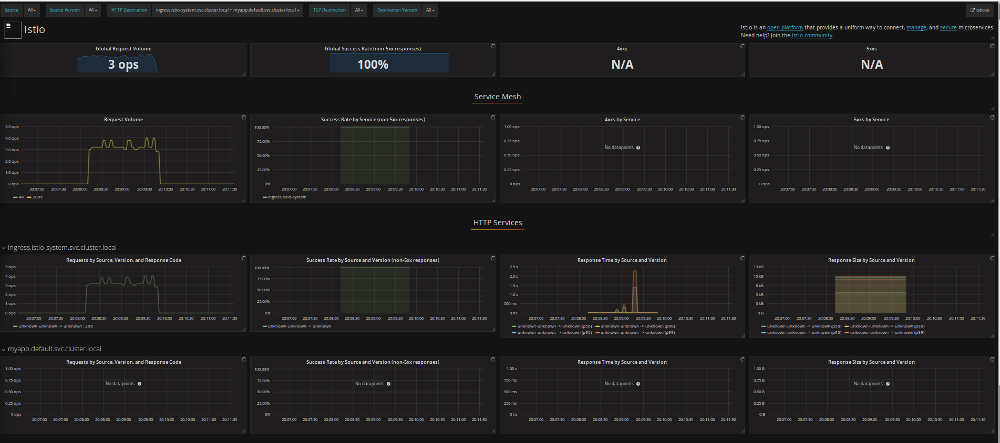


#### Frontend and Backend

Ok, we'll use ```app=myapp``` and ```serverName=myapp``` to be all consistent

To send requests to the frontend and backend, we'll use the applications ```/hostz``` endpoint.


```
for i in {1..1000}; do curl -k -o /dev/null -s -w "%{http_code}\n" https://$GATEWAY_IP/hostz; done
```

Note both ServiceGraph and Grafana shows both frontend and backend service telemetry:

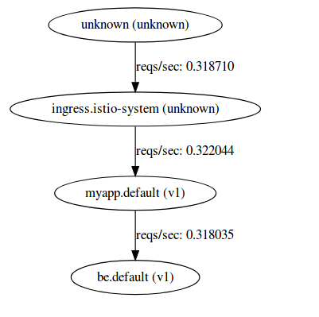


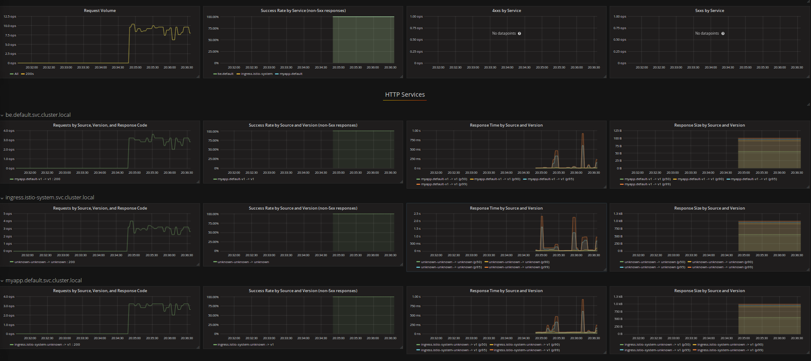

## Route Control

### Selective Traffic (route-rule-all-v1.yaml)

First edit ```all-istio.yaml``` file and set each Deployment for (myapp,be) for both (v1,v2) to have one ```replicas: 1``` each

```
$  kubectl get po,deployments,svc,ing 
NAME                           READY     STATUS    RESTARTS   AGE
po/be-v1-16151855-3vs67        2/2       Running   0          23s
po/be-v2-4191276971-rqv5q      2/2       Running   0          23s
po/myapp-v1-2518991625-twm8s   2/2       Running   0          24s
po/myapp-v2-2198321083-7nqq5   2/2       Running   0          24s

NAME              DESIRED   CURRENT   UP-TO-DATE   AVAILABLE   AGE
deploy/be-v1      1         1         1            1           24s
deploy/be-v2      1         1         1            1           23s
deploy/myapp-v1   1         1         1            1           24s
deploy/myapp-v2   1         1         1            1           24s

NAME             TYPE        CLUSTER-IP      EXTERNAL-IP   PORT(S)    AGE
svc/be           ClusterIP   10.11.249.151   <none>        8080/TCP   24s
svc/kubernetes   ClusterIP   10.11.240.1     <none>        443/TCP    4h
svc/myapp        ClusterIP   10.11.255.183   <none>        8080/TCP   24s

NAME          HOSTS     ADDRESS         PORTS     AGE
ing/gateway   *         35.192.27.246   80, 443   24s

```

Then before we send traffic in, we will setup a routecontrol to:

1. Send all traffic to myapp:v1.  
2. traffic from myapp:v1 to be can only go to be:v2


The YAML will be
```yaml
apiVersion: config.istio.io/v1alpha2
kind: RouteRule
metadata:
  name: fe-v1-be-v2
spec:
  precedence: 1
  match:
    source:
      name: myapp
      labels:
        version: v1
  destination:
    name: be
  route:
  - labels:
      version: v2
    weight: 100
---
apiVersion: config.istio.io/v1alpha2
kind: RouteRule
metadata:
  name: myapp-v1
spec:
  precedence: 2
  destination:
    name: myapp  
  route:
  - labels:
      version: v1
    weight: 100
  - labels:
      version: v2
    weight: 0    
```

THen setup the config with istioctl:

```
istio-<version>/bin/istioctl create -f route-rule-all-v1.yaml 
Created config route-rule/default/fe-v1-be-v2 at revision 30014
Created config route-rule/default/myapp-v1 at revision 30016
```

After sending traffic to check which backend system was called ```/hostz```, we see responses from only
```be-v2-*```

```
$ for i in {1..100}; do curl -k https://$GATEWAY_IP/hostz; printf "\n"; done
[{"url":"http://be.default.svc.cluster.local:8080/backend","body":"pod: [be-v2-9dd4cf9b8-7fbbd]    node: [gke-cluster-1-default-pool-cc917931-xv32]","statusCode":200}]
[{"url":"http://be.default.svc.cluster.local:8080/backend","body":"pod: [be-v2-9dd4cf9b8-7fbbd]    node: [gke-cluster-1-default-pool-cc917931-xv32]","statusCode":200}]
[{"url":"http://be.default.svc.cluster.local:8080/backend","body":"pod: [be-v2-9dd4cf9b8-7fbbd]    node: [gke-cluster-1-default-pool-cc917931-xv32]","statusCode":200}]
[{"url":"http://be.default.svc.cluster.local:8080/backend","body":"pod: [be-v2-9dd4cf9b8-7fbbd]    node: [gke-cluster-1-default-pool-cc917931-xv32]","statusCode":200}]
[{"url":"http://be.default.svc.cluster.local:8080/backend","body":"pod: [be-v2-9dd4cf9b8-7fbbd]    node: [gke-cluster-1-default-pool-cc917931-xv32]","statusCode":200}]
[{"url":"http://be.default.svc.cluster.local:8080/backend","body":"pod: [be-v2-9dd4cf9b8-7fbbd]    node: [gke-cluster-1-default-pool-cc917931-xv32]","statusCode":200}]
[{"url":"http://be.default.svc.cluster.local:8080/backend","body":"pod: [be-v2-9dd4cf9b8-7fbbd]    node: [gke-cluster-1-default-pool-cc917931-xv32]","statusCode":200}]
```

and on the frontend version is always one.
```
$ for i in {1..100}; do curl -k https://$GATEWAY_IP/version; printf "\n"; done
1
1
1
```

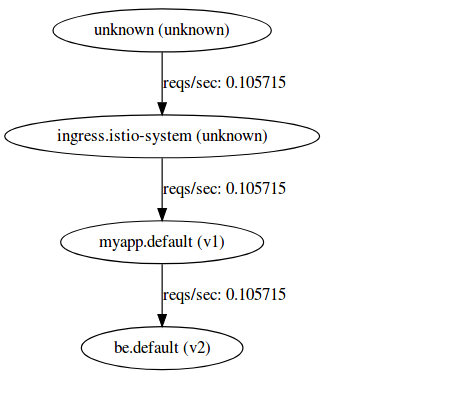

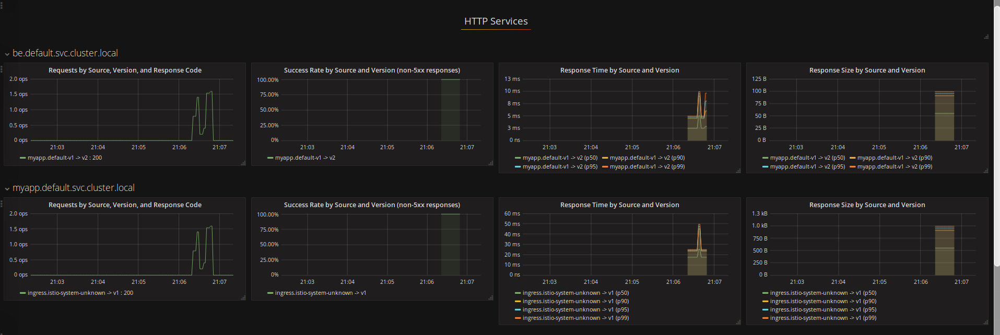


If we delete the route rule, we expect to see requests to both frontend v1 and backend
```
istioctl delete -f route-rule-all-v1.yaml
```

then frontend is both v1 and v2:
```
curl -k https://$GATEWAY_IP/version
1
2
1
2
2
1
```

and backend is responses comes from both be-v1 and be-v2

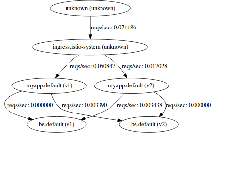

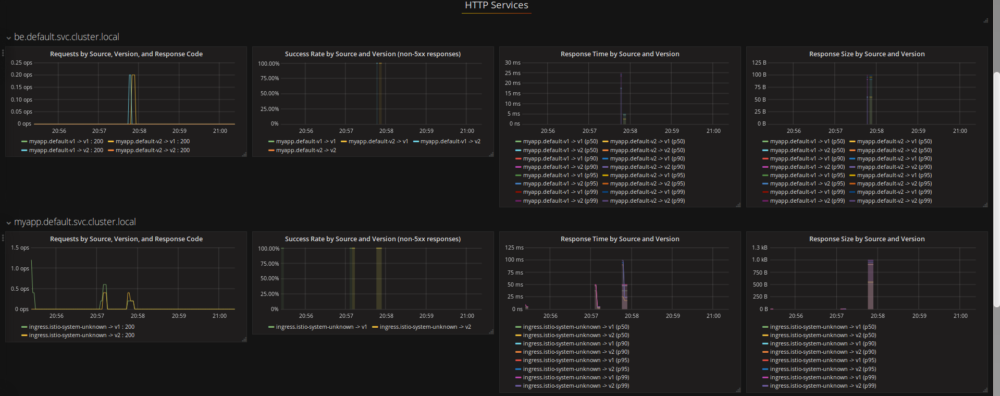

```
$ for i in {1..100}; do curl -k https://$GATEWAY_IP/hostz; printf "\n"; done
[{"url":"http://be.default.svc.cluster.local:8080/backend","body":"pod: [be-v2-9dd4cf9b8-7fbbd]    node: [gke-cluster-1-default-pool-cc917931-xv32]","statusCode":200}]
[{"url":"http://be.default.svc.cluster.local:8080/backend","body":"pod: [be-v2-9dd4cf9b8-7fbbd]    node: [gke-cluster-1-default-pool-cc917931-xv32]","statusCode":200}]
[{"url":"http://be.default.svc.cluster.local:8080/backend","body":"pod: [be-v1-5bc4cc7f6b-qg8mz]    node: [gke-cluster-1-default-pool-cc917931-hxtx]","statusCode":200}]
[{"url":"http://be.default.svc.cluster.local:8080/backend","body":"pod: [be-v1-5bc4cc7f6b-qg8mz]    node: [gke-cluster-1-default-pool-cc917931-hxtx]","statusCode":200}]
[{"url":"http://be.default.svc.cluster.local:8080/backend","body":"pod: [be-v2-9dd4cf9b8-7fbbd]    node: [gke-cluster-1-default-pool-cc917931-xv32]","statusCode":200}]
[{"url":"http://be.default.svc.cluster.local:8080/backend","body":"pod: [be-v2-9dd4cf9b8-7fbbd]    node: [gke-cluster-1-default-pool-cc917931-xv32]","statusCode":200}]

```

> As before, the service graph will inherit the previous tests/scenarios so your graphs will not be the same unless you regen.


### Route Path (route-rule-path.yaml)

- Route requests to myapp where path=/version to only v1
  A request to http://gateway_ip/version will go to v1 only

- then edit rule to change path to /versionx
  A request to http://gateway_ip/version will go to v1 and v2 (since the path rule did not match)

```yaml
---
apiVersion: config.istio.io/v1alpha2
kind: RouteRule
metadata:
  name: myapp-v1-path
spec:
  precedence: 1
  destination:
    name: myapp
  match:
    request:
      headers:
        uri:
          exact: /version
  route:
  - labels:
      version: v1
    weight: 100
  - labels:
      version: v2
    weight: 0    

```


The output below shows before and after applying the route rule.  The '/version' endpoint returns the frontend's pod's version number
so first run

```
$ for i in {1..100}; do curl -k https://$GATEWAY_IP/version; printf "\n"; done
1
2
1
2
1
2
```

then apply the config:

```
$ istio-0.<version>/bin/istioctl create -f route-rule-path.yaml
```

you'll see traffic to only 1
```
$ for i in {1..100}; do curl -k https://$GATEWAY_IP/version; printf "\n"; done
1
1
1
1
1
1
```

### Destination Rules

Send all traffic round robin from myapp-v2 and scale that to just one replica:

```yaml
apiVersion: extensions/v1beta1
kind: Deployment
metadata:
  name: myapp-v2
spec:
  replicas: 0
  template:
    metadata:
      labels:
        app: myapp
        version: v2
```

```
istioctl create -f destination-rule.yaml 
```

```
$  kubectl get po,deployments,svc,ing 
NAME                           READY     STATUS    RESTARTS   AGE
po/be-v1-16151855-r8hn1        2/2       Running   0          29s
po/be-v2-4191276971-6j9q3      2/2       Running   0          28s
po/myapp-v1-2518991625-h521p   2/2       Running   0          29s

NAME              DESIRED   CURRENT   UP-TO-DATE   AVAILABLE   AGE
deploy/be-v1      1         1         1            1           29s
deploy/be-v2      1         1         1            1           29s
deploy/myapp-v1   1         1         1            1           29s
deploy/myapp-v2   0         0         0            0           29s

```


and use the DestinationPolicy:
```yaml
apiVersion: config.istio.io/v1alpha2
kind: DestinationPolicy
metadata:
  name: be-lb-policy
  namespace: default
spec:
  source:
    name: myapp
  destination:
    name: be
  loadBalancing:
    name: ROUND_ROBIN
```

- with myapp scaled to just one replica, ROUND_ROBIN, response is from v1 and v2 alternating:

```bash
$ for i in {1..1000}; do curl -k https://$GATEWAY_IP/hostz; done
[{"url":"http://be.default.svc.cluster.local:8080/backend","body":"pod: [be-v1-16151855-r8hn1]    node: [gke-cluster-1-default-pool-94718a04-lrb5]","statusCode":200}]
[{"url":"http://be.default.svc.cluster.local:8080/backend","body":"pod: [be-v2-4191276971-6j9q3]    node: [gke-cluster-1-default-pool-94718a04-lrb5]","statusCode":200}]
[{"url":"http://be.default.svc.cluster.local:8080/backend","body":"pod: [be-v1-16151855-r8hn1]    node: [gke-cluster-1-default-pool-94718a04-lrb5]","statusCode":200}]
[{"url":"http://be.default.svc.cluster.local:8080/backend","body":"pod: [be-v2-4191276971-6j9q3]    node: [gke-cluster-1-default-pool-94718a04-lrb5]","statusCode":200}]
[{"url":"http://be.default.svc.cluster.local:8080/backend","body":"pod: [be-v1-16151855-r8hn1]    node: [gke-cluster-1-default-pool-94718a04-lrb5]","statusCode":200}]
[{"url":"http://be.default.svc.cluster.local:8080/backend","body":"pod: [be-v2-4191276971-6j9q3]    node: [gke-cluster-1-default-pool-94718a04-lrb5]","statusCode":200}]
[{"url":"http://be.default.svc.cluster.local:8080/backend","body":"pod: [be-v1-16151855-r8hn1]    node: [gke-cluster-1-default-pool-94718a04-lrb5]","statusCode":200}]
[{"url":"http://be.default.svc.cluster.local:8080/backend","body":"pod: [be-v2-4191276971-6j9q3]    node: [gke-cluster-1-default-pool-94718a04-lrb5]","statusCode":200}]
[{"url":"http://be.default.svc.cluster.local:8080/backend","body":"pod: [be-v1-16151855-r8hn1]    node: [gke-cluster-1-default-pool-94718a04-lrb5]","statusCode":200}]
[{"url":"http://be.default.svc.cluster.local:8080/backend","body":"pod: [be-v2-4191276971-6j9q3]    node: [gke-cluster-1-default-pool-94718a04-lrb5]","statusCode":200}]
[
```

- with myapp scaled to just one replica, RANDOM, response is from v1 and v2 random:
```bash
$ for i in {1..1000}; do curl -k https://$GATEWAY_IP/hostz; done
[{"url":"http://be.default.svc.cluster.local:8080/backend","body":"pod: [be-v1-16151855-r8hn1]    node: [gke-cluster-1-default-pool-94718a04-lrb5]","statusCode":200}]
[{"url":"http://be.default.svc.cluster.local:8080/backend","body":"pod: [be-v1-16151855-r8hn1]    node: [gke-cluster-1-default-pool-94718a04-lrb5]","statusCode":200}]
[{"url":"http://be.default.svc.cluster.local:8080/backend","body":"pod: [be-v2-4191276971-6j9q3]    node: [gke-cluster-1-default-pool-94718a04-lrb5]","statusCode":200}]
[{"url":"http://be.default.svc.cluster.local:8080/backend","body":"pod: [be-v1-16151855-r8hn1]    node: [gke-cluster-1-default-pool-94718a04-lrb5]","statusCode":200}]
[{"url":"http://be.default.svc.cluster.local:8080/backend","body":"pod: [be-v2-4191276971-6j9q3]    node: [gke-cluster-1-default-pool-94718a04-lrb5]","statusCode":200}]
[{"url":"http://be.default.svc.cluster.local:8080/backend","body":"pod: [be-v1-16151855-r8hn1]    node: [gke-cluster-1-default-pool-94718a04-lrb5]","statusCode":200}]
[{"url":"http://be.default.svc.cluster.local:8080/backend","body":"pod: [be-v2-4191276971-6j9q3]    node: [gke-cluster-1-default-pool-94718a04-lrb5]","statusCode":200}]
[{"url":"http://be.default.svc.cluster.local:8080/backend","body":"pod: [be-v1-16151855-r8hn1]    node: [gke-cluster-1-default-pool-94718a04-lrb5]","statusCode":200}]
[{"url":"http://be.default.svc.cluster.local:8080/backend","body":"pod: [be-v2-4191276971-6j9q3]    node: [gke-cluster-1-default-pool-94718a04-lrb5]","statusCode":200}]
[{"url":"http://be.default.svc.cluster.local:8080/backend","body":"pod: [be-v2-4191276971-6j9q3]    node: [gke-cluster-1-default-pool-94718a04-lrb5]","statusCode":200}]
[{"url":"http://be.default.svc.cluster.local:8080/backend","body":"pod: [be-v1-16151855-r8hn1]    node: [gke-cluster-1-default-pool-94718a04-lrb5]","statusCode":200}][
```

### Egress Rules


Egress rules prevent outbound calls from the server except with whiteliste addresses.

For example:

```yaml
apiVersion: config.istio.io/v1alpha2
kind: EgressRule
metadata:
  name: allow-googleapis-egress-rule
spec:
  destination:
    service: www.bbc.com
  ports:
    - port: 443
      protocol: https
```


Allows only ```https://www.bbc.com/*``` but here is the catch:  you must change your code in the container to make a call to

```http://www.bbc.com:443```  (NOTE the protocol is different)

This is pretty unusable ..futurue releases of egress+istio will use SNI so users do not have to change their client code like this.

Anyway, to test, the `/requests` endpoint tries to fetch the following URLs:

```javascript
    var urls = [
                'http://www.cnn.com:443/',
                'http://www.bbc.com:443/robots.txt',
                'https://www.bbc.com/robots.txt',
    ]
```

- Without egress rule, each request will fail:

```
$ curl -k https://$GATEWAY_URL/requestz
```

gives

```
[
  {
    "url": "http:\/\/www.cnn.com:443\/",
    "statusCode": {
      "name": "RequestError",
      "message": "Error: read ECONNRESET",
  {
    "url": "http:\/\/www.bbc.com:443\/robots.txt",
    "statusCode": {
      "name": "RequestError",
      "message": "Error: read ECONNRESET",
  {
    "url": "https:\/\/www.bbc.com\/robots.txt",
    "statusCode": {
      "name": "RequestError",
      "message": "Error: read ECONNRESET",
```

#### With egress rule

```
istioctl create -f egress-rule.yaml
```

gives

```
[
  {
    "url": "http:\/\/www.cnn.com:443\/",
    "body": "",
    "statusCode": 404
  },
  {
    "url": "http:\/\/www.bbc.com:443\/robots.txt",
    "statusCode": 200
  },
  {
    "url": "https:\/\/www.bbc.com\/robots.txt",
    "statusCode": {
      "name": "RequestError",
      "message": "Error: write EPROTO 140009593194304:error:140770FC:SSL routines:SSL23_GET_SERVER_HELLO:unknown protocol:..\/deps\/openssl\/openssl\/ssl\/s23_clnt.c:827:\n",
```

Notice that only one of the hosts worked over SSL worked


e## Delete istio and the cluster

```
 kubectl label namespace default istio-injection-
 kubectl delete -f install/kubernetes/addons/zipkin.yaml
 kubectl delete -f install/kubernetes/addons/servicegraph.yaml
 kubectl delete -f install/kubernetes/addons/grafana.yaml
 kubectl delete -f install/kubernetes/addons/prometheus.yaml
 kubectl delete -f install/kubernetes/istio-sidecar-injector-configmap-release.yaml
 kubectl delete --filename=install/kubernetes/istio-sidecar-injector-with-ca-bundle.yaml
 kubectl delete -f install/kubernetes/istio.yaml
```
